#  Reasoning and Verifying NL Semantics in Coq

我们迄今为止一直在开发和研究基于现代类型理论（MTTs）的自然语言（NL）语义，即MTT-语义。我们强调的其中一个方面是，MTT-语义既具有模型论特性又具有证明论特性。作为证明论呈现的形式，MTTs已经被实现在了证明助手中，这些计算机系统由计算机科学家开发用于交互式地推导数学定理和验证程序正确性。因为MTT-语义可以直接在这些系统中实现，基于MTTs的证明助手可以有效地用于推理（Luo 2011b; Chatzikyriakidis and Luo 2014, 2016）。

在这一章中，我们把基于证明助手的证明技术称为证明助手技术[proof assistant technology]，并展示如何实现MTT语义以及如何对前几章研究的语义构造进行形式化并用于推理。我们将使用Coq（Coq 2010）作为证明助手，其类型理论pCIC本质上与我们所称的UTT（Luo 1994）相同（见第2章）[^1]。因此，可以认为我们在Coq实现MTT语义和推理时使用了内涵类型理论UTT。

[^1]: Coq中实现的当前类型理论与UTT基本相同，只是在Coq中引入了共归纳类型[coinductive type]，而UTT中没有（还有一些其他细微差异）。特别是在2004年Coq中的集合`Set`成为谓词时，这一点尤为明显（之前版本的Coq中它是非谓[impredicative]的）。相关说明是，Coq的记录类型[record type]只是$\Sigma$-types，在第2.2.2节介绍并广泛使用于前几章（参见第6.2.4节）。

## Proof assistant technology based on MTTs

自从20世纪60年代初，人们就开始研究证明助手技术，这些人关注的是形式化数学，即交互式证明开发和机器检查数学证明是否正确。一个由此想法发展而来的项目是AUTOMATH项目（De Bruijn 1980）。AUTOMATH是第一个利用Curry-Howard同构[Curry-Howard isomorphism]的系统，并在形式验证方面取得了一些有希望的结果(~~有了盼头~~)。[^2]

[^2]: 有兴趣的读者可以查看AUTOMATH ARCHIVE网页（http://www.win.tue.nl/automath/），以及Nederpelt等人（1994年）的更多信息。

证明助手技术自那时以来取得了长足的进步，并且已经开发出了许多有效的证明助手。这些助手实现了各种类型的逻辑系统。然而，鉴于MTTs具有证明论性质，许多证明助手将MTTs作为其逻辑语言进行实现。一些实现MTTs的证明助手包括Agda（Agda 2008）、Coq（Coq 2010）、Lean（De Moura等人2015年）、Lego（Luo和Pollack 1992年）、Matita（Mat 2008年）、NuPRL（Constable等人1986年）和Plastic（Callaghan和Luo 2001），等等。一些实现经典逻辑的知名证明助手包括Isabelle（Nipkow等人2002年）、HOL（Gordon和Melham 1993年）和Mizar （Naumowicz 和 Korniłowicz 2009）。这种大量涌现的辅助工具在数学证明形式化以及软件验证方面取得了令人印象深刻的成果。其中一些重要结果如下所示。

### Mathematical proofs

- 四色定理：任何简单平面图的区域可以用四种颜色进行着色，使得相邻的两个区域具有不同的颜色 - 在Coq中证明（Gonthier 2008）。

- Feit-Thompson定理的证明：每个奇数阶有限群都是可解的 - 在Coq中证明（Gonthier等人2013）。

- 素数定理：正整数中素数的密度渐近于$1/ln\ x$ - 在HOL和Mizar中证明（Avigad等人2007；Hales 2007）。

- Jordan曲线定理：平面上任意连续简单闭曲线将平面分割为两个不相交的区域，内部和外部 - 在Isabelle中证明（Korniłowicz 2005）。

### Software verification

- CompCert：一个高可信度的编译器，几乎支持所有C语言（ISO C99）。它使用Coq进行实现（Leroy 2013）。

- Coq in Coq: 使用证明助手Coq对构造演算（CoC）的定义和元理论进行形式化。这是在Coq中完成的（Barras and Werner 1997）。

总体上来说，证明助手技术已经达到了成熟的状态，并且有一个蓬勃发展的社区在使用和开发各个证明助手。另一方面，我们可以声称，在语义学研究中，MTT-语义学也已经达到了成熟的阶段。鉴于这种背景，我们认为现在是一个好时机来探讨如何将证明助手应用于语义学研究。这就是我们将在本章中讨论的内容。但在继续之前，我们需要首先介绍一下我们将要使用的证明助手：Coq。

## A linguist friendly introduction to Coq

在这一部分中，我们介绍了证明助手Coq（Coq 2010）。目的是为从事语义学工作的人提供使用该助手和/或证明助手技术的动机。因此，我们将尽可能用语义学示例来说明Coq的主要特点。

简单地说，Coq背后的主要思想可以粗略地总结如下：我们使用Coq来查看基于先前预定义或用户定义（定义、参数、变量）的陈述所构成命题是否可证明。正如我们所说，Coq是一个依赖类型的证明助手，实现了归纳构造演算（CiC；参见 Coq 2010）。这意味着用于表达这些不同命题的语言是MTT。对于使用MTTs进行自然语言语义学研究而言，这是一个很好的起点。可以说，Coq“说”我们用来解释语义学的语言。鉴于Coq实际上是一个推理引擎，在研究与之重叠程度较高的自然语言语义学时至少有两种方法可以使用：(1)作为一个形式检查器，用于检查自然语言语义中提出的理论是否在语义上有效和(2)自然推理(NLI)，即利用NL进行推理。

备注：安装的临时说明。Coq可以通过访问系统的网站在所有平台上轻松安装[^3]。我们也可以使用Macports、Homebrew或Nix来获取它。对于Mac和Linux用户，建议使用Proof General[^4]，这是一个为emacs提供多个证明助手支持的Coq界面。正如我们已经提到的，在非常非正式的层面上，我们可以说Coq实现语言与本书中迄今为止一直在使用并在第2章正式介绍过的MTT（即UTT）之间的主要区别是Coq中使用了缺乏于我们迄今所呈现内容中以及Coq实现中未曾用到过的共归纳类型。这两个系统还有其他次要差异，但这些超出了本书范围，并且对理解本章讨论和实现没有重要作用。

### Basics of Coq: types, sorts, functions

在Coq中，所有的对象都有一个类型。举个例子，考虑以下在Coq中进行类型检查的情况，使用命令Check后跟要检查的对象：

```coq
Coq < Check nat
nat: Set
Coq < Check 1
1: nat
```

请注意，自然数的类型是集合类型，而1的类型是自然数类型。集合是一个谓词型宇宙，类似于UTT中最低的谓词型宇宙 $Type_{0}$ ：[^5]

```coq
Coq < Check Set
Set: Type
```

Set和Type是宇宙的概念。Coq使用一个良基的宇宙层次结构，其中包含无限数量的谓词性宇宙和一个非谓词性宇宙，即逻辑命题（Prop）所在的宇宙。这与UTT（见第2.3节）类似，UTT也使用了这个特性，即一个非谓词性宇宙（Prop）和无限数量的谓词性 宇域。因此，Coq就像UTT一样实现了一个非谓词MTT。简化一下，Coq中有三个主要的 宇域：Set、Prop和Type。Set是Coq中预定义的规范/数据类型所在的 宇域，而Prop则是逻辑命题所在 的 宇域。Type是更大且更通用 的 一个 安全, 包括前两者。[^6]

[^5]: 在Coq的早期版本中，Set是一个非谓词宇宙。在2004年发布的Coq 8.0版本之后，Set变成了谓词（见第127页脚注1）。
[^3]: http://coq.inria.fr/download.
[^4]: https://proofgeneral.github.io.
[^6]: 请注意，$Type$ 也是 $Type$ 类型的一种。然而，吉拉尔悖论（Girard's paradox）在现实中并不适用，因为 $Type$ 实际上是一个无限层次的类型体系。例如，$Set$ 在现实中属于 $Type_{0}$ 类型，而 $Type_{0}$ 又属于 $Type _{1}$ 类型，以此类推无穷迭代。因此，$Type$ 实际上表示某个带有下标 $i$ 的类型 $Type_i$（其中 $i$ 是自然数），只是下标部分被省略了。这得益于像 Coq 和 Lego 这样的证明助手通过实施一种称为典型模糊性（typical ambiguity）的技术来实现。因此，默认情况下 Coq 隐藏了这些额外信息，但我们可以通过输入命令 "$Set\ Printing\ Universes$" 来查看它们。

要声明新的信息（例如类型），可以使用参数（以及变量）：

```coq
Coq < Variable H : Set.
H is assumed
Warning: H is declared as a parameter because it is at a global level
Coq < Parameter H: Set.
H is assumed
Coq < Section section.
Coq < Variable H1: Set.
H1 is assumed
```

请注意，如果在全局上下文中使用Variable来声明某个东西，它与Parameter完全相同。然而，如果它在特定的部分内声明，则只在该特定部分的上下文中有效。另一方面，定义具有以下一般形式：

(6.1) $Definition\ \mathrm{ident} :term 1:= term 2$

上面的代码行检查 $term 2$ 的类型是否与 $term 1$ 在定义上相等，并将 ident 注册为 $term 1$ 类型的变量，绑定到值 $term 2$。

函数类型可以按照通常的方式进行定义。例如，让我们看看在通常的蒙塔戈维安设置中如何定义Man。为了简单起见，我们首先假设类型 $\mathbf{e}$ 作为 $Set$ 类型的参数，然后将 $\mathbf{t}$ 定义为 $Prop$ 宇宙。现在，我们准备好将 $Man$ 定义为从实体$(\mathbf{e})$到命题$(\mathbf{t})$的函数：

```coq
Parameter e: Set.
Definition t:= Prop.
Parameter Man: e -> t.
```

我们可以进一步按照蒙塔戈的方式来定义“人”，即将其视为接受类型为 $\mathbf{e}$ 的参数，并指定属性 $Man$ 适用于$x$ ：[^7]

```coq
Definition man:= fun x: e=> Man(x).
```

[^7]: 需要注意的是，这相当于通过eta转换将其等价于 $Man$ 。

`Fun` 代表着 $\lambda$ 抽象。实际上，如前所述，上述定义是一个谓词的经典Montagovian定义：$\operatorname{man}=\lambda x \cdot \operatorname{Man}(x)$。如果我们询问Coq关于man的类型，它会返回正确的类型，即它能够推断出正确的类型。如果我们想在定义中指定类型，则可以在实际定义符号$(:=)$之前添加这些信息：

```coq
Definition man: e -> t:= fun x: e => Man(X).
```

让我们使用另一个例子来说明lambda抽象的用法，这次是非语言的例子：定义平方函数。简单来说，平方函数接收一个自然数类型（nat）的参数，并返回一个与该参数相乘得到的结果，同样也是自然数类型（$nat$）的值。

```coq
Definition square:= fun x: nat => x*x.
```

在这种情况下，我们可以除了检查函数square的类型之外，还可以要求Coq计算类型为nat的元素的平方。这是通过Eval compute in命令来完成的：

```coq
Eval compute in square 3.
	= 9: nat
```

在上面的例子中，命令 Eval compute in square 3 要求 Coq 计算表达式 square 3 的值，即将函数 square 应用于自然数 3。我们也可以使用 Eval compute 命令来评估 man John。结果如下所示：

```coq
Eval compute in man John
	= Man John: Prop
```

Coq返回将谓词man应用于参数John的结果。结果是Man John（注意大写的Man来自小写man的定义）。Coq还通知我们，将man应用于John会返回一个命题。

### The proof engine of Coq

在这一部分中，我们介绍了Coq的定理证明机制。为了完成给定的证明，用户必须使用一些预定义（或用户定义）的策略来尝试证明目标或目标集合。为了说明这个工作原理，我们将使用简单命题逻辑（propositional logic/PL）证明。首先，我们引入一个名为propositional的部分，并定义了一些命题变量（即类型为Prop的变量）。

```coq
Parameters P Q R: Prop.
Theorem trans:
	(P -> Q) -> (Q -> R) -> (P -> R).
```

Theorem命令将Coq置于证明模式中。用户必须尝试引导证明者找到一个证明。为了证明这个非常简单的PL定理，我们使用了一个非常有帮助和基本的策略，叫做intro。intro策略做的事情很简单：它将目标中蕴含式的前提移到证明上下文中作为一个假设。通过这样做，现在需要被证明的是蕴含式的结论部分。应用三次intro策略后，我们得到需要被证明的目标是 $R$ 以及三个假设 $H$ , $H 0$ 和 $H 1$ .

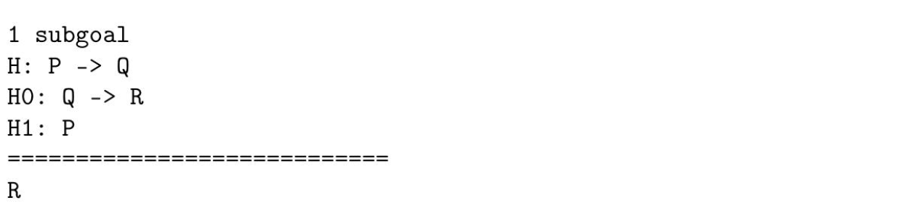

在这一点上，另一个非常基本且有用的策略可以使用：应用。这个策略接受一个可以分解为前提和结论的参数（例如，应用 $Q \rightarrow R$ ），如果结论与要证明的目标$(R)$相匹配，则创建一个新目标，在此目标中必须证明假设的前提$(Q)$（实际上是小前提法则[modus ponens]）：

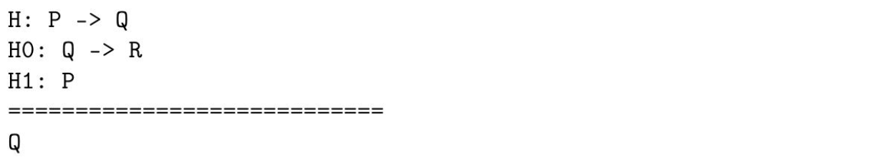

我们现在可以再次使用apply，但这次是对$H$应用（$apply\ H$)：

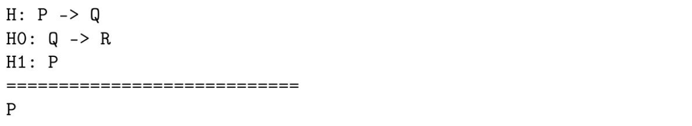

请注意，要证明的目标$(P)$现在是我们假设之一。可以使用策略假设将目标与假设列表中的相同假设匹配。证明完成后，我们使用 `Qed` 命令保存证明。

现在让我们来看一个更复杂的证明。我们想要证明皮尔斯定律（Peirce's law）可以从排中律（LEM）推导出来：

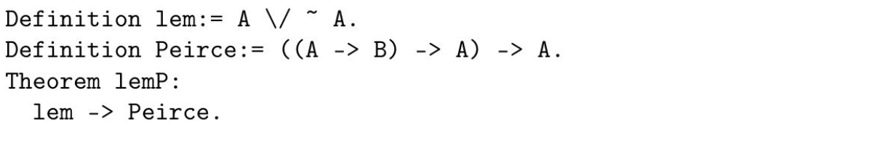

首先要做的是展开lem和Peirce的定义。有一个同名命令（unfold $x$）可以做到这一点，即它展开了$x$的定义：

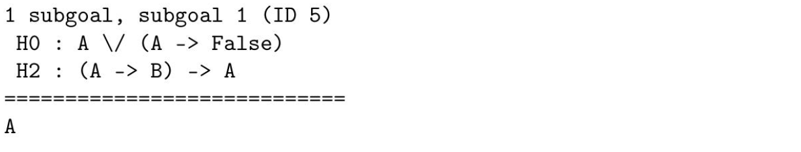

使用elim策略对假设$H 0$进行操作，应用相关联结词的消除规则，在我们所关注的特定情况下，即析取的情况：

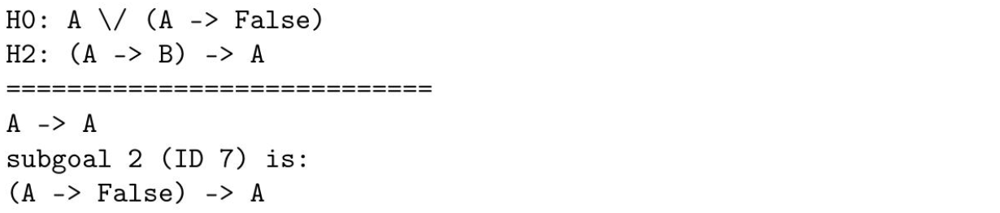

使用引言和假设，第一个子目标得到证明。现在我们再次使用引言，并应用$H 2$ ：

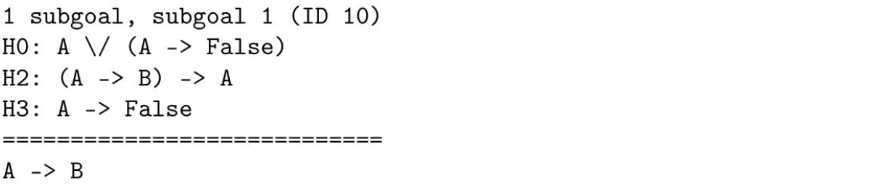

我们再次进行介绍，此时我们可以使用荒谬[absurd]策略来处理 $A$。这个策略将应用假设消除规则对 $A$ 进行推导，并要求我们通过证明 $A$ 及其否定来证明 False：

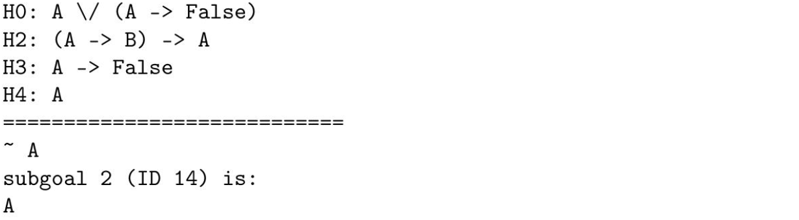

使用两次假设，定理得以证明，前提是在证明的语境中同时出现 $A$ 和 $\neg A$ 。

### Useful proof tactics in Coq

在这一部分中，介绍了Coq的一些最重要的预定义证明策略。我们想讨论的基本策略可以根据每种情况涉及到的连接词进行分类，其中一些列在表6.1中[^8]。为了举例说明其中一些，我们将简要介绍Montague语义学（Partee 2002）中经典类型转换操作符。这仅用于说明目的。在这方面，并没有对MG底层类型系统进行深度嵌入。正如本章已经讨论过的那样，我们将Montague的类型 $\mathbf{e}$ 定义为 $Set$ 宇宙，将Montague的类型 $\mathbf{t}$ 定义为逻辑命题 $Prop$ 宇宙。然后我们定义如下内容：

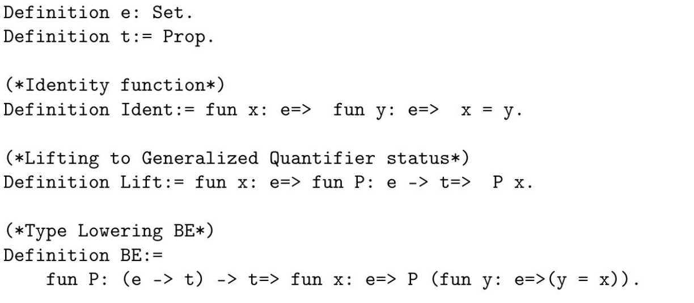

[^8]: This is based on a table by Adam Chlipala: http://adam.chlipala.net/itp/tactic-reference.html.

| Connective                    | Introduction tactics                                      | Elimination tactics                                          |
| ----------------------------- | --------------------------------------------------------- | ------------------------------------------------------------ |
| $\wedge$ (conjunction)        | `split` (variant of `constructor`)                        | `elim` (variant of `induction`)                              |
| $$\vee$$ (disjunction)        | `left`, `right`                                           | `elim` (variant of `induction`)                              |
| $$\Rightarrow$$ (implication) | `intro [a]`, `intros [a b H]`, `intros until a`           | `apply t`, `apply t` with `$(\mathrm{a}:=\mathrm{t})$        |
| `False`                       |                                                           | `absurd`                                                     |
| `Exists`                      | `exists t`                                                | `elim` (variant of `induction`)                              |
| `Forall`                      | `intro [a]`, `intros [a b H]`, `intros until a`           | `elim` (variant of `induction`), `subst`, `replace`          |
| $=$                           | `reflexivity`, `symmetry`, `transitivity t`, `congruence` | rewrite $[<-]$ , rewrite $[<-]\ \mathrm{t}$ in $\mathrm{H}$ , subst, replace |
| $\neg$                        | `elim` (variant of `induction`)                           | `intro`                                                      |

> 表6.1 根据逻辑连接词的一些重要Coq证明策略

这些是蒙塔古传统中非常典型的类型转换操作。我们进一步定义了一些常量、几个谓词以及量词every和some：

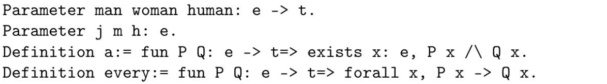

首先，我们评估表达式：我们对常量 `John (j)` 应用Lift，并且评估表达式John是一个男人。

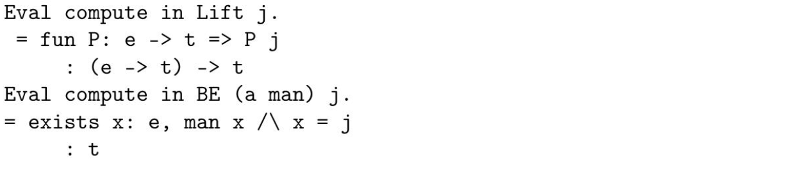

这些是我们期望的结果，无论是在类型方面还是实际语义方面。现在，让我们进行一些推理。我们想要看到是否可以得出一个实体就是从“John is a man”中的John：

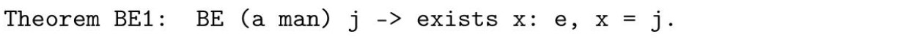

我们从策略 `unfold` 开始，展开对$BE$的定义。然后我们使用intro：

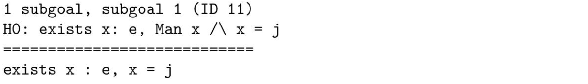

现在，我们可以在 $\mathrm{H} 0$ 中使用存在量词的消去规则。这是通过 $elim\ \mathrm{H0}$ 来完成的。

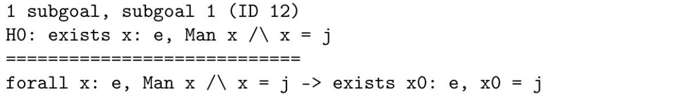

使用intros：

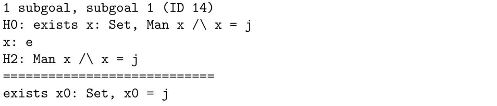

在假设中有一个连词，我们可以使用合取消去规则[the elimination rule for conjunction]，即 $elim\ \mathrm{H2}$ :

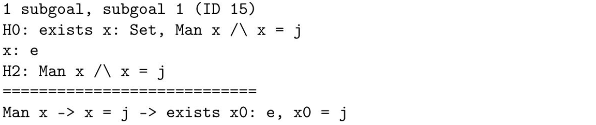

使用intros：

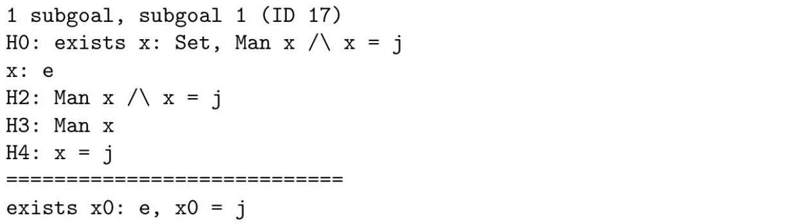

在这一点上，我们可以用假设将$x$替换为$x0$并证明定理。

我们进一步简要总结了几个等式策略（自反性、传递性和对称性）、idtac、cut和归纳的功能：

1. 自反性：每当需要证明形式为 $A=A$ 的目标时，其中$A: Type$。

2. 对称性：每当需要从假设 $B=A$ 中证明形式为 $A=B$ 的目标时，其中 $A, B: Type$。

3. 传递性：每当需要从假设 $A=B$ 和 $B=C$ 中证明目标 $A=C$ 时，其中 $A, B, C: Type$。

4. idtac：什么都不做！作为复合策略的一部分很有用，在这种策略中我们希望对某些部分应用某些策略而保持其他部分不变。

5. cut：假设我们想要证明 $P$, 并且我们有两个解决方案：
   - $t_1$ for $Q\rightarrow P$ ;
   - $t_2$ for $Q$ ;
   - the application of $t_1$ $t_2$ proves $P$ .

​	cut 策略提供了这个组合推理步骤。

6. 归纳：$induction\ x$ 将目标语句分解为适用于 $x$ 的属性，然后应用 $elim\ x$。

让我们看一个涉及对称性和传递性的例子：


我们使用 $intros$ ，$destruct\ H$ 和 $splits$ 。Destruct是一种类似于elim的策略，不同之处在于，destruct会为构造该项可能使用的每个构造函数创建子目标。所有这些步骤完成后的结果如下：

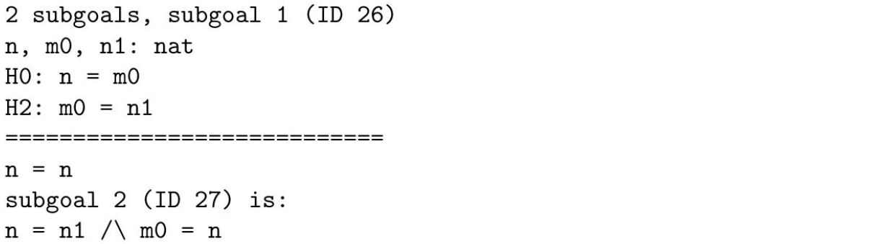

利用反身性[reflexivity]，我们可以证明第一个目标。现在我们使用split，然后是传递性 $m 0$ ：

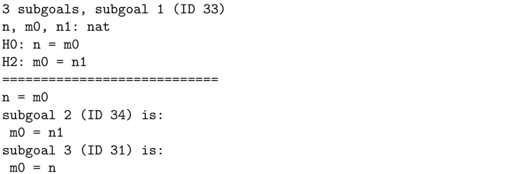

我们使用了两次假设，接着是对称性和再次假设，从而证明了我们的定理。

Coq还提供了自动化策略，即为证明提供某种形式的自动化。以下是一些常见的策略：

1. auto：如果一个证明可以通过使用以下任意一种策略找到，则提供自动化：intros、apply、split、left、right和reflexivity。

2. eauto：它是auto的变体。它还使用与auto中使用的策略相似但稍有不同的变体策略，唯一区别在于它们可以处理涉及存在量词（例如eapply函数类似于apply但进一步引入存在变量）的结论。

3. tauto：用于命题直观主义重言式。

4. firstorder：用于直观主义一阶重言式。

由于空间限制，我们在这里结束对策略使用的讨论。然而，感兴趣的读者可以参考Bertot和Casteran（2004）、Coq（2010）和Chlipala（2013），以获取更多关于所讨论策略以及Coq证明助手详细全面介绍方面的信息。

### Inductive types and record types

在这一部分中，我们将对Coq中的一些非常有用的类型进行简要介绍，包括归纳类型和记录类型[^9]。考虑以下在Coq中的类型声明：

```coq
Parameter A: Type.
```

[^9]: 有关归纳类型的更多信息，请参阅第2.2节。Coq中的记录类型只是带有关于投影操作符命名约定的Σ-类型（请参阅第2.2.2节）。它们并不是真正的记录类型[record type] - 有兴趣的读者可以查阅相关论文，包括（Pollack 2002; Luo 2009a,b）。

如上所述，关于构成类型的元素、它们的属性或者构造方式没有进一步的信息。归纳类型可以看作是提供有关其实例构造方法的类型。更具体地说，归纳类型告诉我们其实例是如何形成的，并为用于形成这些实例的构造规则命名。例如，让我们来看一下 Coq 中布尔型（bool）的定义。

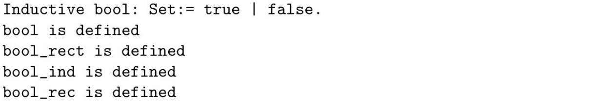

上述定义介绍了一个新的 $Set$ 类型bool。然后声明了这个集合类型的构造函数，即true和false，并提供了三条消除规则[elimination rule]，允许我们对这种类型进行推理。例如，bool_ind组合子允许我们证明每个$b: bool$ 要么是true要么是false。请注意，在这种类型中没有递归。因此，它是一种无递归的归纳类型。涉及递归的归纳类型的一个例子是自然数的类型，即nat:

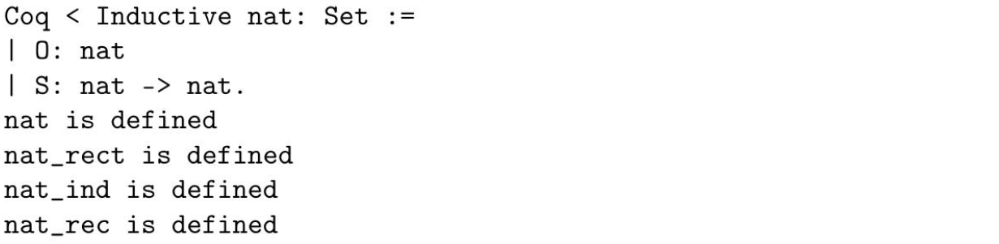

归纳类型是其构造函数定义了该类型的所有元素的类型。 (nat_ind) 构造函数基本上是 Peano 的归纳公理：如果一个属性对于基础情况（即 0）成立，并且在继承关系下进一步封闭（即如果它对于 $n$ 成立，则对于 $S n$ 也成立），那么它对于所有 $n$ 都成立。另外两个运算符 nat_rect 和 nat_rec 可以用来定义自然数上的函数。更具体地说，nat_ind 可以通过归纳法证明普遍命题，并可以通过 nat_rect 来定义。运算符 nat_ind 对于 $Prop$ 宇宙是相关的，nat_rect 对于 $Type$ 宇宙是相关的，而 nat_rec 对于 $Set$ 宇宙是相关的。让我们看一下如何定义 nat_ind:

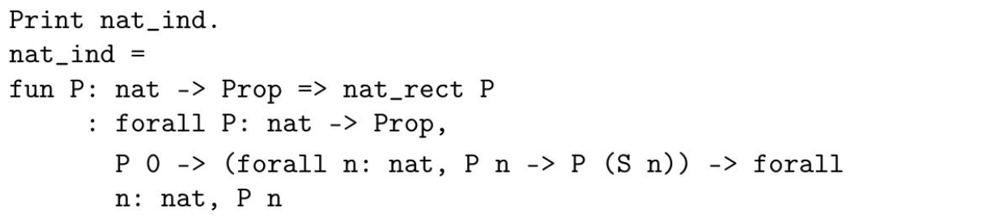

nat_rect运算符则定义如下：

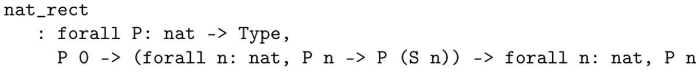

运算符nat_rec也是通过nat_rect定义的，但与nat_ind不同的是，它适用于 $Set$ 宇宙而非 $Prop$ 宇宙。实际上，nat_rect是一个更一般的递归公理，定义在 $Type$ 宇宙中，即包括 $Set$ 和 $Prop$ 两者的宇宙，这解释了为什么在nat_ind和nat_rec的定义中都使用了它。

归纳类型的一个特殊情况是记录类型。记录类型本质上就是只有一个构造函数的归纳类型。它们被用来将数据片段捆绑到单个类型中。例如，假设我们对Montagovian实体（类型$\mathbf{e}$）的整体定义不满意，并且我们想要定义一个更结构化的实体类型，其中包含两个字段：(1) 一个涉及$\mathbf{e}$ 类型元素和 (2) 另一个谓词 $human$ 应用于该元素。

```coq
Record Entity: Set:= mkentity {x: e; z: human x}
```

因此，$Entity$ 是一种类型为 $Set$ 的记录类型（就像类型e是类型Set的一样），它由类型为 $e$ 的字段 $x$ 和类型为 $human\ x$ 的字段 $z$ 组成。实际上，这是一个依赖记录类型，因为字段 $z$ 的类型取决于 $x$ 。熟悉库珀（Cooper）记录型理论（TTR）的人们将会认识到在Coq中表达这种语义的潜力。[^10]

现在让我们继续以一个更符合本书所支持语义学观点的例子。请记住，在第3.3节中提到过，形容词修饰，至少包括交叉修饰和子集修饰形容词，在MTT语义学中被编码为$\Sigma$-types[^11]。而在Coq中，依赖记录类型等同于$\Sigma$-types。因此，对于使用$\Sigma$-type方法来编码形容词修饰问题时，我们可以使用Coq的依赖记录机制：

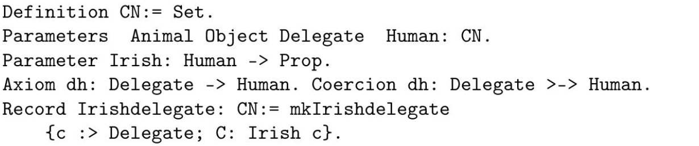

[^10]: 我们可以使用Coq的依赖记录类型机制对TTR处理的许多事物进行编码。
[^11]: 请参阅第2.2.2节，了解有关$\Sigma$类型及其与依赖记录类型的关系的更多信息。

一些解释在这里是必要的。第一行将宇宙$\mathsf{CN}$等同于 $Set$ [^12]。 在第二行，定义了一些 $\mathsf{CN}$ 类型。在第三行，定义了谓词 $Irish$ 。第四行是关键的一行，因为它涉及到Coq子类型机制，基本上是强制子类型化的一个版本。它声明 $Delegate$ 是 $Human$ 的一个子类型。最后一行是修饰后的名词 $Irish\ delegate$ 的定义。请注意，$:>$ 符号将第一投影声明为强制转换。简单来说，这意味着 $Irish\ delegate$ 是 $delegate$ 的一个子类型。事实上确实如此：我们可以证明如果Irish delegate走路，则delegate也会走路，此外人类也会走路：

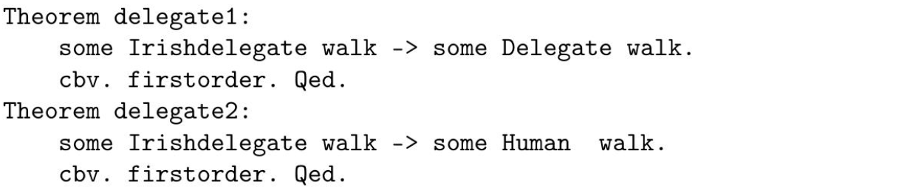

[^12]: Coq不允许我们指定新的宇宙（与像Plastic这样的证明助手不同，在那儿你可以指定）。因此，我们使用$Set$来定义$\mathsf{CN}$，尽管$\mathsf{CN}$本应该是个独立宇宙。

这是我们对Coq的简要介绍。接下来，我们将在Coq中形式化我们关于自然语言语义的提议，并通过检查它们是否能正确地进行推理预测来验证其形式上的正确性。

## MTT-semantics in Coq

