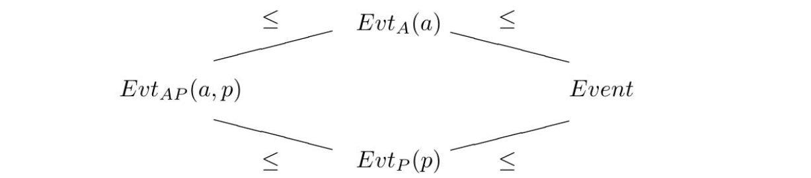

# Advanced Topics

在本章中，我们讨论了一些关于MTT语义的高级主题。这些包括对断言解释的命题形式的研究（第3.2.3节的正式处理），依赖事件类型（Dependent Event Types/DETs；具有精细化事件类型的新Davidsonian事件语义）和依赖范畴语法（Dependent Categorial Grammars/DCGs；带有依赖类型的Lambek风格范畴语法）。这些主题在以下三个独立部分中进行讨论，因此可以单独阅读。

## Propositional forms of judgmental interpretations: formal treatment

如在3.2.3节中所解释的那样，在MTT语义学中存在着断言或类型不匹配的解释，为了解释复合句子，我们可能需要将断言解释转化为命题。这可以通过以下示例来说明，并且这些示例取自于第3.2.3节（第62-64页）：

- 可推导的断言：例子有（3.62）；

- 否定下无法推导的断言：例子有（3.66）和（3.67）；

- 否定下类型不匹配的应用：例子有（3.79）和（3.82）。

上述断言解释对应着命题形式。在这里，我们将以更正式、更精确的方式研究它们。本节应与第3.2.3节关于命题形式非正式介绍一起阅读，并基于各种先前研究成果进行讨论 (Xue et al., 2018,2020; Chatzikyriakidis and Luo, 2017b) 。鼓励感兴趣的读者从这些论文中获取更详细信息。[^1]

[^1]: 在本节中，我们将使用非归谓类型理论UTT（Luo 1994）。对于一个归谓类型理论，我们可以用一些归谓宇宙（例如，在Luo（2018a）中的系统$\mathrm{MLTT}_h$）替换全体Prop，然后可以得到类似的结果。

我们首先介绍真谓词 $p_{A}$，用于给出可推导成员断言的命题形式。然后，研究了非运算符和 $\mathrm{\small IS}$ 和 $\mathrm{\small DO}$ 运算符：最后两个可以通过 $\mathrm{\small NOT}$ 来定义，在负面语境中使用时，它们用于给出不可推导断言或类型错误应用的命题形式。 $\mathrm{\small NOT}$ 运算符以公理化引入，并且将通过异构相等性[heterogeneous equality]在类型理论中证明所有非公理定律（McBride 2002; McBride and McKinna 2004）。我们还将研究在什么条件下可以使用 $\mathrm{\small IS}$ 和 $\mathrm{\small DO}$ 而不会产生过度生成。

**可推导断言的命题形式。**当形如 $a: A$ 的断言解释是可推导的时候，它的命题形式表示为 $p_{A}(a)$，其中对于任意类型 $A$，$p_{A}$ 是以下定义的“真谓词”（与 (3.64) 相同）：

(7.1) $p_{A}: A \rightarrow \operatorname{Prop}$

(7.2) 对任意 $x: A$ 有 $p_{A}(x)= \mathbf{true}$  

作为一个例子，复合句（3.62）在此重复为（7.3），可以解释为（7.4），其中 $p_{\text {Human }}(j)$ 充当了 $j: Human$ 的命题形式。

(7.3) $\text{John is a human and he is happy.}$

(7.4) $p_{\text {Human }}(j) \wedge \operatorname{happy}(j)$

请注意，$p_{A}(a)$ 的定义是在条件 $a$ 是类型 $A$ 的情况下为真。因此，$p_{A}(a)$ 不完全等同于真，因为 $p_{A}(a)$ 的良好类型性假设了 $a$ 是类型 $A$，而为真的良好类型性则没有这样的假设。换句话说，良好类型的 $p_{A}(a)$ 携带比为真更多的信息，即它假定$a$ 是类型 $A$。这就是为什么 $p_{A}(a)$ 可扮演可推导断言 $a: A$ 的命题形式角色的原因。

**$\mathrm{\small IS}$ 、 $\mathrm{\small DO}$ 的定义与 $\mathrm{\small NOT}$ 运算符。**在负面语境中，可以有意义地使用不可推导的断言解释和类型错误的应用（参见第3.2.3节中的示例（3.66）、（3.67）、（3.79）和（3.82））。它们的命题形式可以通过 $\mathrm{\small NOT}$ 运算符来表示，其类型如(7.5)所示：它需要四个参数来构成一个命题 $\mathrm{\small NOT}(A, p, B, b)$ ，其中 $A$ 和 $B$ 是 $\mathsf{CN}$ 中的普通名词，$p: A \rightarrow  Prop$ 是 $A$ 上的谓词，并且 $b$ 是类型为 $B $ 的对象。直观地说，$\mathrm{\small NOT}(A, p, B, b)$ 意味着“$b$ does not $p$" ，特别当 $p = p_{A}$ （如上所定义的关于 $A $ 的真谓词）时，则意味着“$b$ 不是一个  $ A $"。

(7.5) $\mathrm{\small NOT} : X: \mathsf{CN}\ \Pi p: X \rightarrow Prop\ \Pi Y: \mathsf{CN}\ \Pi y: Y. Prop$

我们可以使用 $\mathrm{\small NOT}$ 来定义两个操作符 $\mathrm{\small IS}$ 和 $\mathrm{\small NOT}$ ，通过以下的定义缩写方式，其中 $A, B: \mathsf{CN}$ [^2]

(7.6) $\mathrm{\small IS}_{B}: \mathsf{CN} \rightarrow B \rightarrow Prop$

(7.7) $\mathrm{\small IS}_{B}(X, y)=\neg \mathrm{\small NOT}\left(X, p_{X}, B, y\right)$ , for any $X: \mathsf{CN}$ and $y: B$

(7.8) $\mathrm{\small DO}_{A, B}:(A \rightarrow Prop ) \rightarrow B \rightarrow Prop$

(7.9) $\mathrm{\small DO}_{A, B}(p, y)=\neg \mathrm{\small NOT}(A, p, B, y)$ , for any $p: A \rightarrow Prop$ and $y: B$

[^2]: 在Xue等人（2018）中（定义3.1），我们已经定义了命题$P_{A, B}: B \rightarrow Prop$。在当前的符号表示中，我们有$P_{A, B}(t)=\operatorname{\small IS}_{B}(A, t)$。

有时候（通常在示例中），我们会省略下标，用 $\mathrm{\small IS}(X, y)$ 表示 $\mathrm{\small IS}_{B}(X, y)$ ，用 $\mathrm{\small DO}(p, y)$表示 $\mathrm{\small DO}_{A, B}(p, y)$ 。直观地说，$\mathrm{\small IS}(X, y)$和 $\mathrm{\small DO}(p, y)$ 分别意味着" $y$ is an $X$"和"$y$ does $p$"。如何使用运算符 $\mathrm{\small IS}$ 和 $\mathrm{\small DO}$ 的示例包括第3.2.3节中的(3.71)对应于(3.66)，(3.72)对应于(3.67)，(3.81)对应于(3.79)，以及 (3.84) 对应于 (3.82)。

**NOT的公理定律和示例。**运算符 $\mathrm{\small NOT}$ 是通过公理引入的。特别地，它应满足下面的$\left(A_{1}-A_{5}\right)$定律来规范其行为，其中 $A, B, C: \mathsf{CN}$ 且 $A \preceq B$ 表示存在一个单射函数[injective function] $c$ 从 $A$ 到 $B$（即对于所有$x_{1}, x_{2}: A$ ， $c\left(x_{1}\right)=c\left(x_{2}\right)$ 意味着 $x_{1}=x_{2}$ ）。

$\left(A_{1}\right)\ \forall p: A \rightarrow Prop \forall x: A . \neg \mathrm{\small NOT}(A, p, A, x) \Leftrightarrow p(x)$

$\left(A_{2}\right)\ \forall p, q: A \rightarrow Prop.[\forall x: A . p(x) \Rightarrow q(x)] \Rightarrow[\forall y: B . \mathrm{\small NOT}(A, q, B, y) \Rightarrow \mathrm{\small NOT}(A, p, B, y)]$

$\left(A_{3}\right)$ 若 $A \preceq B$ 那么 $\forall p: B \rightarrow Prop \forall z: C. \mathrm{\small NOT} (B, p, C, z) \Rightarrow \mathrm{\small NOT}(A, p, C, z)$

$\left(A_{4}\right)$ 若 $A \preceq B$ 那么 $\forall p: C \rightarrow Prop. [\forall y: B . \mathrm{\small NOT}(C, p, B, y)] \Rightarrow[\forall x: A.\mathrm{\small NOT} (C, p, A, x)]$

$\left(A_{5}\right)$ 若 $A \preceq B$ 那么 $\forall p: C \rightarrow Prop. [\exists x: A . \mathrm{\small NOT}(C, p, A, x)] \Rightarrow[\exists y: B . \mathrm{\small NOT}(C, p, B, y)]$

使用 $\mathrm{\small DO}$ 运算符，我们可以将上述定律重写为下面的形式 $\left(A_{1}^{d}-A_{5}^{d}\right)$ ，这样更直观易懂。例如，第一个定律 $\left(A_{1}\right)$ 或 $\left(A_{1}^{d}\right)$ 表示当 $x: A$（因此 $p(x)$ 是良类型），$\mathrm{\small DO}(p, x)=\neg \mathrm{\small NOT}(A, p, A, x)$ 在逻辑上等价于 $p(x)$ ；特殊情况下当 $p=p_{A}$ 时，$\mathrm{\small IS}(A, x)=$ $\neg \mathrm{\small NOT}\left(A, p_{A}, A, x\right)$ 在逻辑上等价于 $p_{A}(x)$ 。

$\left(A_{1}^{d}\right)\ \mathrm{\small DO}_{A, A}(p, x) \Leftrightarrow p(x)$

$\left(A_{2}^{d}\right)\ [\forall x: A . p(x) \Rightarrow q(x)] \Rightarrow[\forall y: B . \mathrm{\small DO}(p, y) \Rightarrow \mathrm{\small DO}(q, y)]$

$\left(A_{3}^{d}\right) \text { If } A \preceq B \text {, then } \mathrm{\small DO}_{A, C}(p, z) \Rightarrow \mathrm{\small DO}_{B, C}(p, z)$

$\left(A_{4}^{d}\right) \text { If } A \preceq B \text {, then } \forall y: B . \neg \mathrm{\small DO}_{C, B}(p, y) \Rightarrow \forall x: A . \neg \mathrm{\small DO}_{C, A}(p, x)$

$\left(A_{5}^{d}\right) \text { If } A \preceq B \text {, then } \exists x: A . \neg \mathrm{\small DO}_{C, A}(p, x) \Rightarrow \exists y: B . \neg \mathrm{\small DO}_{C, B}(p, y)$

我们现在为每个规则提供一个例子以作说明：例子（i）是关于 $\left(A_{i} / A_{i}^{d}\right)$ 的，而对于每个例子 $(i)$，$\left(i^{\prime}\right)$ 解释了规则 $\left(A_{i}^{d}\right)$ 的运作方式。

$(1)\ \text{ John is not a man.}$

$(1^{\prime})\ \neg p_{Man}(j) \Leftrightarrow \neg \neg \operatorname{\small NOT}\left(\right. Man, p_{Man}, Man, \left.j\right)=\neg \operatorname{\small IS}(M a n, j)$, where $j: Man$ .

$(2)\ \text{If a table doesn't talk, then it doesn't talk loudly.}$

$\left(2^{\prime}\right)\ \forall t: Table. \neg \mathrm{DO}( talk,t) \Rightarrow \neg \mathrm{DO}\left(t a l k \_l o u d l y, t\right)$ , where $talk, talk\_ loudly : Human \rightarrow Prop$ and $\forall h: Human. talk\_loudly (h) \Rightarrow \operatorname{talk}(h)$.

$(3)\ \text{If Teddy is a man, then Teddy is a human.}$

$\left(3^{\prime}\right)\ \mathrm{\small IS} ( Man, Teddy ) \Rightarrow \operatorname{\small IS}( Human, Teddy)$ , where $Teddy : Toy$ and $Man \preceq Human$ .

$(4)\ \text{If tables do not talk, then red tables do not talk, either.}$

$\left(4^{\prime}\right)\ [\forall t: Table. \neg \mathrm{\small DO}( talk,t)] \Rightarrow[\forall r: R Table. \neg \mathrm{\small DO}( talk,r)]$ , where $talk : Human \rightarrow Prop$ and $RTable =\Sigma( Table, red ) \preceq Table$ . [^3]

$(5)\ \text{Since not every linguist is a logician, not every human is a logician.}$

$\left(5^{\prime}\right)\ [\neg \forall l: Linguist.\mathrm{\small IS} ( Logician, l)] \Rightarrow[\neg \forall h: H uman.\mathrm{\small IS} ( Logician,h)]$ , where $Linguist \preceq Human$ .

[^3]: 这个 $\Sigma( Table, red ) \preceq Table$，即 $\Sigma( Table, red )$ 是通过一个单射[injective]强制转换成为 Table 的子类型，这是基于证明不可区分性的假设[assumption of proof irrelevance]：对于 $red : Table \rightarrow Prop$ ，对任意的 $x, y: Table$ 都有 $\operatorname{red}(x)=$ $\operatorname{red}(y)$。关于证明不可区分性的更多内容，请参考 Luo (2012a, 2018a)。

**通过异质平等[heterogeneous equality]来进行证明。**在上述中，$\mathrm{\small NOT}$ 被公理地引入以扩展基础MTT。这样的扩展是否可行（例如，逻辑上一致）？对于这个问题的答案是肯定的；换句话说，可以对这个扩展进行合理化。提供这种合理化有很多不同的方式。例如，可以继续证明扩展系统的元理论性质，直接显示该扩展是一致的等等。然而，这过于冗长，并且需要大量努力。另一个解决方案是考虑已知一致扩展 $E$ 和基础类型理论 $T$ 并执行以下操作：

1) 已知：$T+E$ 是一致的。

2) 在 $T+E$ 中，通过使用 $E$ 的方式定义 $\mathrm{\small NOT}$。

3) 利用这个定义，证明 $\left(A_{i}\right)(i=1, \ldots, 5)$ 是 $T+E$ 中的定理。

4) 因此，我们知道 $T+\mathrm{\small NOT}$ 是一致的。

问题是：对于上述情况，什么是一个合适的概念$E$？幸运的是，有这样一个概念$E$：我们可以使用$\mathrm{JMeq}$，这是由McBride（McBride 2002; McBride and McKinna 2004）研究过的异构相等性[^4]。 $\mathrm{\small NOT}$ 可以通过$\mathrm{JMeq}$来定义，并且它的逻辑一致性可以如上所示地展示出来：我们在这里只简要考虑此问题 - 更多技术细节请参阅Xue等人（2020）。

通常，在类型理论中，我们只能形成两个相同类型对象之间的相等命题。然而，异构相等性允许我们讨论不同类型参数之间的相等关系。$\mathrm{JMeq}$就是这样一种异构相等性，其类型如式(7.10)所示。直观地说，$\mathrm{JMeq}(A, a, B, b)$ 表示 $a$ 和 $b$ 是相等的，尽管它们的类型 $A$ 和 $B$ 可能不同。

(7.10) $\mathrm{JMeq} : \Pi A:Type\ \Pi x: A\ \Pi B: Type\ \Pi y: B. Prop$

[^4]: $\mathrm{JMeq}$是由McBride（2002）提出并命名为“John Major平等”。

根据(7.11)的定义，" $b$ 不是 $p$ " 不能通过 $\mathrm{JMeq}$ 来定义。该定义表示对于集合 $A$ 中的任意元素 $x$，如果 $x$ 等于 $b$，那么 $p(x)$ 不成立。

(7.11) $\mathrm{\small NOT}(A, p, B, b)=\forall x: A . \operatorname{JMeq}(A, x, B, b) \Rightarrow \neg p(x)$

我们可以证明以下定理，以展示在具有 $\mathrm{JMeq}$ 的MTT中，$\mathrm{\small NOT}$ 的公理法则都是定理。作为一个推论，由于扩展了 $\mathrm{JMeq}$ 后逻辑上一致，所以通过 $\mathrm{\small NOT}$ 进行扩展也是一致的。

**定理 7.1.**- 如果 $\mathrm{\small NOT}$ 定义为 (7.11) 中的形式，那么在通过 $\mathrm{JMeq}$ 扩展的类型理论中，$\left(A_{i}\right)(i=1, \ldots, 5)$ 都是可证明的。

**避免过度生成。**如上所述，并在第3.2.3节中非正式介绍，一些句子的解释涉及不可推导的断言或类型不匹配的应用，在某些否定语境下可能具有意义，并且在这种情况下，可以通过由NOT定义的IS/DO运算符赋予它们合法的语义。然而，显然我们不能毫无限制地使用像IS/DO这样的运算符，否则会发生过度生成。例如，通常桌子和人类不共享对象，因此(7.14)是不可推导的，并且 $talk(t)$ 在(7.15)中是类型不匹配的($talk: Human \rightarrow Prop$)。我们不使用(7.16)和(7.17)来解释(7.12)和(7.13)。

(7.12) (\#) $\text{John is a table.}$

(7.13) (\#) $\text{Tables talk.}$

(7.14) $j: Table$

(7.15) $\forall t: Table. \operatorname{talk}(t)$

(7.16) $\mathrm{\small IS}(Table, j)$

(7.17) $\forall t: Table. \mathrm{\small DO} (t a l k, t)$

在这一部分中，我们研究了条件，以便可以使用IS/DO运算符而不会出现过度生成的风险。我们将研究两个概念：第一个是类型不相交性[type disjointness]，第二个是负面事件[negative occurrence]，这两个概念对于适当地使用IS和DO以避免过度生成非常重要（Luo and Xue 2020）。

类型不相交性。当 $j: Man$ 时，像 $j: Table$ 和 $j: Woman$ 这样的断言是不可推导的。这种不可推导并非微不足道：它假设Man类型与Table和Woman类型是互斥的。以下是关于类型不相交性概念的定义。

**定义7.1（类型不相交性）。**- 设 $A$ 和 $B$ 为类型。如果不存在非空类型 $C$ 使得 $C \leq A$ 且 $C \leq B$ , 则称 $A$ 和 $B$ 是互斥的。

当无法推导时，断言解释表示自然语言句子没有意义（至少通常如此，除非在某些虚构或特殊情境下）。同样地，一些命题应用也属于错误输入。例如，在 $talk : Human \rightarrow Prop$ 和 $t: Table$ 的情况下, $talk (t)$ 是错误输入。这类错误输入通常也代表着无意义的句子。如果一个断言不能被推导出来，那么使用NOT（以及IS和DO）来表示相应的语义会导致过度生成：例如，如果分别使用(7.19)和(7.21)来解释(7.18)和(7.20)，则会发生过度生成，其中我们假设 $Man/Woman$ 和 $Human/Table$ 是互斥对。

(7.18) (\#) $\text{John is a woman. }$

(7.19) (\#) $\mathrm{\small IS}(Woman, j)$, where $j: Man$

(7.20) (\#) $\text{Tables talk.}$

(7.21) (\#) $\forall t: Table.\mathrm{\small DO} ( talk, t)$, where $talk : Human \rightarrow Prop$.

*负面事件。*在语义解释中，运算符IS/DO可以用于发生负面情况（或在负面背景下发生）。使用辅助概念“不良形式表达式”（ill-formed expression/IFE）来定义负面事件的概念，其归纳定义如下：

1) 不可导断言是IFE；

2) 类型错误的命题应用是IFE；

3) 如果 $A$ 或 $B$ 是IFE，则 $A \wedge B$ 和 $A \vee B$ 都是IFE；

4) 如果 $A$ 是 IFE，则 $\forall x: T . A$ 和 $\exists x: T . A$ 都是 IFE。

**定义7.2（负面事件）**。- 设 $A, B, C$ 的形式为 $P_{1} \oplus \ldots \oplus P_{n}$，其中 $P_{i}$ 是原子公式，$\oplus\in\{\wedge, \vee\}$ 且 $n\geq 1$ ， 则，

- 在 $\neg A$ 中，出现了 $A$ 及其子公式的负面情况;

- 在 $A \Rightarrow B$ 中出现了 $A$ 及其子公式的负面情况;

- 如果 $A$ 是 IFE，在 $A \Rightarrow B$ 中出现了 $B$  及其子公式的负面情况;

- 如果某个子公式在 $A$ 中以负面方式出现，则它也会以负面方式在 $\forall x: T . A$, 和 $\exists x: T . A$ 中出现;

- 如果某个公式在 $A \Rightarrow B \Rightarrow C$ 中以负面方式出现，则它也会以负面方式在 $A \wedge B \Rightarrow C$ 中出现。

以下是一些示例，说明IS/DO公式如何在合法解释中以负面方式发生而不产生过度生成。

(7.22) $\text{Women are not men.}$

(7.23) $\forall x: Woman. \neg \mathrm{\small IS}(Man, x)$

(7.24) $\text{Tables do not talk.}$

(7.25) $\forall x: Table. \neg \mathrm{\small DO}(talk, x)$

(7.26) $\text{If tables talk, so do chairs.}$

(7.27) $[\forall x :Table. \mathrm{\small DO}( talk,x)] \Rightarrow[\forall y :Chair. \mathrm{\small DO}( talk,y)]$

## Dependent event types

事件语义的研究始于戴维森（1967），并在其新戴维森转向中得到进一步研究（参见帕森斯（1990）等人）。事件语义具有几个显著优点，包括戴维森最初提出的为副词修饰提供令人满意的语义解释。依赖类型在事件语义中提供了有用的工具，在本节中，我们概述了依赖事件类型(Dependent Event Type/DET)（Luo和Soloviev 2017, 2020）在提供充分语义解释方面的工作。虽然DET可以添加到Church简单类型理论或MTTs中，并且因此可用于Montague语义或MTT语义，但在本节中，我们只描述Montagovian设置下的DET（关于基于MTTs的事件语义如何使用DET，请参见Luo和Soloviev (2017, 2020)）。

**Davidsonian事件语义学。**在形式语义学中引入事件的最初动机是为了解决对副词修饰的解释问题。考虑（7.28）和（7.29）：直观上，我们应该认为（7.29）的语义解释蕴含着（7.28）的语义解释。然而，在传统的Montagovian语义学中，这并不是一件简单明了的事情。例如，对于 $butter: \mathbf{e} \rightarrow \mathbf{e} \rightarrow \mathbf{t}$ 和 $with\_knife, in\_kitchen :(\mathbf{e} \rightarrow \mathbf{t}) \rightarrow \mathbf{e} \rightarrow \mathbf{t}$ ，我们可以分别用（7.30）和（7.31）来解释（7.28）和（7.29）。但是，要使得$(7.31) \Rightarrow(7.30)$成立，我们就必须依赖于意义假设，比如说如果$f$ 是 $with\_knife$ 或者 $i n_{-} k i t c h e n$ ，那么我们总有 $f(p, x) 	\Rightarrow p(x)$ 。这样的意义假设相当特殊且不尽人意。

(7.28) $\text{John buttered the toast.}$

(7.29) $\text{John buttered the toast with the knife in the kitchen.}$

(7.30) $butter (j, toast )$

(7.31) $in\_kitchen (with\_knife(butter (j)))( toast)$

Davidson（1967）在语义学中引入了事件的概念，他声称动词暗含着存在量化的事件，并且动词和状语短语[adverbial phrases]都是对事件的谓词。在具有主要角色（如施事者和受事者）的新Davidsonian符号表示法中，将它们表示为类型为 $Event \rightarrow \mathbf{e}$ 的函数 $agent$ 和 $patient$ 。句子（7.28）和（7.29）可以分别解释为（7.32）和（7.33），其中 $Event$ 是所有事件的类型，$j$ 和 $t$ 分别是"John" 和 "the toast" 的解释。[^5]

[^5]: 请注意，传统上大多数人不会明确写出事件类型，并且只使用符号约定。例如，我们通常将(7.32)写作$\exists v. butter (v) \wedge agent(v)=j \wedge patient(v)=t$，省略了Event并表示变量$v$范围是事件。此外，在写$\exists v$时，有些人甚至可能意味着$\exists v:\mathbf{e}$，即$v$范围涵盖所有实体（而事件只是特殊的实体）。我们理解为$\exists v:Event$，并保持开放态度是否$Event \leq \mathbf{e}$（即事件是否属于实体）。

(7.32) $\exists v :Event. butter (v) \wedge agent (v)=j \wedge patient (v)=t$

(7.33) $\exists v :Event. butter (v) \wedge agent (v)=j \wedge patient (v)=t\wedge with\_knife (v) \wedge i n \_k i t c h e n(v)$

这样的事件语义解释在副词修饰方面更令人满意：例如，现在很明显情况是 (7.33) $\Rightarrow$ (7.32)（前者有更多的连词），而不需要施加任何意义假设。[^6]

[^6]: 事件语义还有其他优点。例如，基于事件的语义意味着副词修饰可以相互交换位置，正如Landman（2000）所指出的那样；否则，我们将不得不添加进一步的含义假设来强制执行这些约束条件。

然而，引入事件和事件量词可能会导致问题，在不小心处理的情况下需要付出代价。其中一个问题是，事件量词可能会与语义描述中的其他量词产生意外干扰，一些研究者将此描述为事件语义与蒙塔古语义之间的不兼容性问题或事件量化问题（Event Quantification Problem/EQP）（Winter and Zwarts 2011; Champollion 2015; De Groote and Winter 2014）。例如，在（7.34）中，预期的（新戴维森式）事件语义可以是（7.35），其中$talk : Event \rightarrow \mathbf{t}$。然而，还有另一种可能的解释方式，即将事件量词移到左侧以扩大其作用范围，得到结果为（7.36）。尽管直观上来说，对于解释（7.34）来说，“(7.36) 是错误的”，但它却像正确答案一样被接受：(7.36) 是一个合法公式；从形式上讲，并不容易说明为什么 (7.35) 是 (7.34) 的正确解释而 (7.36) 不是。

(7.34) $\text{Nobody talked.}$

(7.35) $\neg \exists x : \mathbf{e}. [ human (x) \wedge \exists v: Event. talk (v) \wedge \operatorname{agent}(v)=x]$

(7.36) (\#) $\exists v : Event. \neg \exists x : \mathbf{e}. \operatorname{human}(x) \wedge \operatorname{talk}(v) \wedge \operatorname{agent}(v)=x$

为了避免类似于（7.36）这样的错误解释，研究人员提出了几个我们认为要么是特例要么涉及不必要复杂性的建议[^7]。DET 的一个应用是它们对事件量化问题提供了自然解决方案。

**依赖事件类型。**在传统的蒙塔古设置中的戴维森事件语义中（Davidson 1967; Parsons 1990），只有一种类型 $Event$ 表示所有事件：例如，句子（7.37）可以解释为（7.38），其中 $talk, loud : Event \rightarrow \mathbf{t}$.

[^7]: 这些提议包括，例如，Landman（1996）的非正式范围域原则[informal Scope Domain Principle]，该原则不允许错误的解释；以及Champollion（2015）对事件集合的考虑，这将带来一些复杂性，其对直觉正确性和组合性的影响尚不清楚。

(7.37) $\text{John talked loudly.}$

(7.38) $\exists v: Event. \operatorname{talk}(v) \wedge \operatorname{loud}(v) \wedge \operatorname{agent}(v)=j$

我们建议考虑更精细的事件类型：不仅仅是所有事件的单一类型Event，我们引入了DET（Dependent Event Type），这些事件类型依赖于某些参数，如主体和受事[patients]。例如，假设Agent是主体的类型，并且对于$a: Agent$，依赖类型 $E v t_{A}(a)$ 表示主体为 $a$ 的事件类型。通过使用DET，(7.37)可以解释为(7.39)，其中$talk(v)$和$loud(v)$具有良好的类型因为 $v$ 的类型 $Evt_{A}(j)$是 $Event$ 的子类。

(7.39) $\exists v: E v t_{A}(j) . \operatorname{talk}(v) \wedge \operatorname{loud}(v)$

注意，我们现在可以从DET的事件中恢复主题[thematic]功能。例如，对于$a: Agent$，我们可以定义$\operatorname{\small AGENT}_{A}[a]$，使得对于任何事件$v: \operatorname{Evt}_{A}(a), \operatorname{\small AGENT}_{A}[a](v)=a$。

一般来说，DET的参数通常是主题角色（如施事者和受事者）的名称。形式上，一个$n$元DET由类型为$A_{1}, \ldots, A_{n}$的对象参数化。在这里，我们只考虑$n=0,1,2$ 的 $n$ 元事件类型：

- 当 $n=0$ 时，事件类型通常写作 $Event$ ，并且没有参数。$Event$ 对应于传统环境中所有事件的类型；

- 当 $n=1$ 时，我们只考虑 $E v t_{A}(a)$ 和 $E v t_{P}(p)$ 这两种情况，在其中 $a: Agent$ 和 $p: Patient$ ，即这些是依赖于施事者 $a$ 或受事者 $p$ 的事件类型。例如，如果 John 是一个具有解释 $j$ 的施事者，则 $E v t_{A}(j)$ 是其施事者为 John 的事件类型（见 (7.39)）；

- 当 $n=2$ 时，我们只考虑 $\operatorname{Evt}_{A P}(a, p)$ 这种依赖于施事者 $a$ 和受事者 $p$ 的事件类型。例如，在 $\operatorname{Evt}_{A P}(j, m)$ 中，施事者和受事者分别是 John 和 Mary。

我们可以将其他原型角色作为参数考虑，例如方式[manners]和说话者[utterers]，这将导致相应的事件类型，如依赖于施事者和方式的 $E v t_{A M}(a, m)$ 以及依赖于说话者和方式的 $\operatorname{Evt}_{U M}(u, m)$ ，正如第4章中所提到的。

事件类型之间存在自然子类型关系。例如，一个施事者为 $a$ 而受事者为 $p$ 的事件是具有施事者 $a$ 的事件。换句话说，类型 $\operatorname{Evt}_{A P}(a, p)$ 是 $\operatorname{Evt}_{A}(a)$ 的子类型。如果我们只考虑 $Event$, $E v t_{A}(a)$, $E v t_{P}(p)$ 和 $E v t_{A P}(a, p)$ 这些事件类型，则它们之间有以下子类型关系：

(7.40) $E v t_{A P}(a, p) \leq E v t_{A}(a) \leq E v e n t$ and $\operatorname{Evt}_{A P}(a, p) \leq E v t_{P}(p) \leq E v e n t$

可以用图7.1来描述。

> 图7.1 代理人和受事者参数化的DET之间的子类型关系

DETs有几个有趣的应用，其中之一是它们为事件量化问题(Event Quantification Problem/EQP)提供了自然解决方案[^8]。在具有DETs的Montagovian设置中（形式上表示为$\mathcal{C}_{e}$），EQP问题可以自然而形式地得到解决 - 通过将事件量词与其他量词交换而获得的不正确语义解释被排除，因为它们是类型错误和非法公式。例如，在(7.34)中句子"Nobody talked"可以给出语义(7.41)，相应的不正确语义(7.42)是非法的（$x$在$E v t_{A}(x)$中超出了绑定变量$x$的范围（尽管直观上它指代它），实际上是一个未声明的自由变量），因此是一个非法公式。

(7.41) $\neg \exists x: \mathbf{e} .\left[human(x) \wedge \exists v: E v t_{A}(x) . talk(v)\right]$

(7.42) (\#) $\exists v: E v t_{A}(x) . \neg \exists x: \mathbf{e} . human(x) \wedge talk(v)$

[^8]: 除此之外，DET的另一个用途是在事件语义中促进选择限制[selectional restriction]的处理，尤其是在MTT环境中（Luo 2018a）。

请注意，这与传统环境中没有DET的情况形成对比。例如，错误的语义（7.36）仍然是良类型且无法在不诉诸于一些非正式原则的情况下被正式排除。换句话说，我们声称DET提供了EQP问题的自然解决方案，并且与现有的使用非正式特设原则的解决方案相比，该解决方案作为引入DET的“副作用”自然而来：它在形式上是纪律性和自然性。

**$\mathcal{C}_{e}$：Montagovian环境中的DET。**依赖事件类型可以在Montagovian环境或MTT环境中引入，并且两者都已经在Luo和Soloviev（2017）中进行了研究。在这里，我们只考虑如何将DET添加到前者即带有DET的简单类型理论中，并证明扩展 $\mathcal{C}_{e}$ 保守地覆盖了Church's简单类型理论 $\mathcal{C}$ 。 $\mathcal{C}_{e}$ 的推理规则如下所示：它们基于 $\mathcal{C}$ 的规则以及 DETs 的规则。

- 简单类型理论的规则：$\mathcal{C}_{e}$ 包含了 $\mathcal{C}$ 的所有推理规则（参见第1.3.1节和附录A1.1），只是 $\lambda$ 规则多了一个前提条件（实际上是一个边界条件），变成了以下形式：

$$
\frac{\Gamma, x: A \vdash b: B \quad x \notin F V(B)}{\Gamma \vdash \lambda x: A . b: A \rightarrow B}
$$

在 $\mathcal{C}$ 中，$F V(B)$ 是出现在 $B$ 中的自由变量集合。请注意，在 $\mathcal{C}$ 中不需要副条件，因为在 $\mathcal{C}$ 中没有依赖类型（并且 $x$ 肯定不会自由地出现在 $B$ 中）。

- 主题角色和DET的规则。

$$
\begin{aligned}
 &\frac{\Gamma \text { valid }}{\Gamma \vdash \text {Agent type }} \quad \frac{\Gamma \text { valid }}{\Gamma \vdash \text {Patient type }}\quad \frac{\Gamma \text { valid }}{\Gamma \vdash \text {Event type }}\\ \\
&\frac{\Gamma \vdash a: Agent}{\Gamma \vdash Evt_A(a) \text { type }} \quad \frac{\Gamma \vdash p: Patient}{\Gamma \vdash Evt_P(p) \text { type }} \quad \frac{\Gamma \vdash a: Agent\ \Gamma \vdash p: Patient}{\Gamma \vdash Evt_{A P}(a, p) \text { type }}
\end{aligned}
$$

- 包含规则[subsumption rule]。

$$
\frac{\Gamma \vdash a: A\quad \Gamma \vdash B\ type\quad A \leq B}{\Gamma \vdash a: B}
$$

在这里，子类型关系 $\leq$ 是相对于转换 $\simeq$（见第8页脚注10）的最小偏序[partial order]。它满足以下两个条件：

1) 对于箭头类型来说，它是逆变的[contravariant]：如果 $A^{\prime} \leq A$ 且 $B \leq B^{\prime}$ ，则 $A \rightarrow B \leq A^{\prime} \rightarrow B^{\prime}$ 。

2) DET之间的子类型关系（如图7.1所示）符合式(7.40)中的定义。[^9]

已经证明了通过DET扩展Church简单类型理论得到的扩展 $\mathcal{C}_{e}$ 是保守的（Luo和Soloviev 2020），即下面给出了保守性定理。由于保守扩展基本上保留了原始系统的良好特性，包括逻辑一致性，在下面给出了推论。

**定理7.2（保守性）。**$\mathcal{C}_{e}$ 是 $\mathcal{C}$ 的一个保守扩展[conservative extension]。

证明.- 定义从 $\mathcal{C}_{e}$ 到 $\mathcal{C}$ 的映射 $R$ 如下：$R$ 将 $Agent$、$Patient$、$Event$ 和 $E v t_{\bar{K}}(\bar{k})$ 映射到 $\mathbf{e}$ ，并将不包含这些类型的每个项映射到其自身（此映射是递归定义的）。然后，可以验证 $R$ 保持可导性[preserves derivability]；即对于任何推导 $D$ ，在 $R$ 下的映像是一个 $\mathcal{C}$-derivation。注意到 $R$ 在任何 $\mathcal{C}$-judgment 上都是恒等映射，因此如果一个 $\mathcal{C}$-judgment 在 $\mathcal{C}_{e}$ 中可导，则它也在 $\mathcal{C}$ 中可导。因此，我们得出结论：$\mathcal{C}_{e}$ 是 $\mathcal{C}$ 的一个保守扩展。

**推论7.1（一致性）。**$\mathcal{C}_{e}$ 是逻辑上一致的。

[^9]: 在Montagovian的设定中，需要注意的是DET之间的子类型关系是包容性的。

## Dependent categorial grammars

在这一部分中，我们将探讨如何在依赖类型的基础上扩展范畴语法。首先要注意的是，范畴语法是基于子结构演算（例如Lambek演算）的，因此要研究是否可以将其与依赖类型相结合，并且如果可能的话，如何获得依赖型Lambek类型。在这方面，第二作者已经研究了依赖子结构类型，并特别关注了DCG中的依赖Lambek类型，在该研究中展示了如何将它们视为对应于MTT-语义类型的句法类别，这是进一步研究DCG理论基础所取得的有希望的一步。我们将研究如何引入这种Lambek $\Pi$ 型和 $\Sigma$ 型，并探讨实施此类语义学时会产生哪些后果。值得注意的是，本文报告的一些想法仍然只是初步设想，在未来需要进行验证或进一步发展。

首先我们讨论不涉及依赖类型下名词作为类型范式在范畴语法设置中，并显示出这样做会打开选择性和句法限制方面新机遇。特别地，我们表明我们可以选择更严格的句法和语义类型，或者仅选择更严格的语义类型。这会产生不同的后果：在第一种情况下，涉及类别错误的句子解释为既不符合语义也不符合句法要求，而在第二种情况下只是在语义上不符合要求。然后我们继续介绍Lambek演算中包含依赖类型的内容（如Luo 2015所述），除了Lambek演算中已有的类型构造器外，还进一步引入了用于依赖乘积$\left(\Pi^{r}\right.$ 和 $\left.\Pi^{l}\right)$以及依赖求和($\Sigma^{\sim}$ 和 $\Sigma^{\circ}$) 的定向型。接着我们讨论了使用Lambek $\Pi$ 型来建模涉及量词和副词的句子示例，并探讨了定向$\Sigma$-型与形容词修饰之间的相关性。关于后者, 我们认为可以使用定向$\Sigma$-型来模拟与前置位置和后置位置相关联的阶段与个体水平区分。

**范畴语法：一些历史注解。**范畴语法是一系列相关的高度词汇化形式主义，旨在处理自然语言的句法和语义。范畴语法对于语言学家的吸引力主要在于它将语言变异视为词汇化的结果，其中与特定语言相关的属性由词汇驱动，但同时，与特定语言无关的属性则是根据这些项目中信息应用非常少量组合规则得出的结果。通常提到范畴语法时会引用Lambek（1958），但范畴语法的根源可以追溯到Ajdukiewicz（1935）；Bar-Hillel（1953）甚至Russell关于类型理论和Frege关于函数分析等方面（Morrill 2011）。Ajdukiewicz版本的范畴文法在句法类型中不包括方向信息。基本类型有两种：sentence 和 name，并且还有一个基本操作——取消模式[cancelation schema]，如下所示：

(7.43) $\frac{B}{A} A \Rightarrow B$

$\frac{B}{A}$ 是一个表达式，当它与类型为$A$的表达式结合时会简化为$B$。Lambek（1958）和Yehoshua等人（1960）提出了范畴语法的方向性版本，其中取消规则现在分成两个规则：

(7.44) $B / A, A \Rightarrow B$

(7.45) $A, A \backslash B \Rightarrow B$
$$
\begin{array}{|l|l|}
\hline \text {John}: \mathsf{np} \\
\text {Mary}:  \mathsf{np} \\
\text {likes}  :\mathsf{(n p \backslash S) / n p)} \\
\hline
\end{array}
$$

> 表7.1 方向性句法类型

让我们通过首先定义一个玩具词典来看一个简单的例子，以了解这是如何工作的。在表7.1中列出了一些词汇项及其对应的类型。有了这个基础，"John loves Mary" 这个句子的简单推导过程如下：

后来，λ-类型语义被添加进去，并提供了一个系统的映射方式，将范畴句法和范畴语义（λ演算）联系起来（Van Benthem 1988; Moortgat 1988）。从那时起，范畴语法已经发展了很长一段时间，并且提出了许多不同的系统，更灵活地处理自然语言句法中丰富的模式。其中一些扩展包括Steedman的组合性范畴文法（Combinatory Categorial Grammar/CCG）(Steedman 2000)，Levine和Kubota的混合类型逻辑文法（HTLG）(Kubota and Levine 2015)以及De Groote的抽象范畴文法（Abstract Categorial Grammars/ACG）(De Groote 2001)，等等。关于使用这些模型或者使用某些范畴语法扩展进行广泛覆盖解析在NLP中处理各种句法现象有大量研究资料可供参考，比如CCG。我们在这里不会涉及到这些更灵活版本的范畴语法，而是试图引发对如何为范畴语法配备依赖类型进行讨论。

引入依赖类型到Lambek风格语法的动机是什么？从不同的角度来看，我们认为至少有两个很好的原因支持这样做：对于那些研究使用依赖类型的某种版本语义学的人来说，它为他们提供了一个句法演算和紧密的句法/语义对应关系；对于那些已经在进行某种范畴语法研究的人来说，它为他们提供了更精细化的语义机制。将依赖类型引入范畴语法是一项以前尚未尝试过但已经提出了零星讨论和建议的努力。例如，Ranta（1998）讨论了将类型依赖性引入定向类型并给出了一个激发人心的例子来表示量词定向类型，尽管该论文没有研究此扩展形式上处理方法。De Groote和Maarek（2007）研究如何通过（直觉主义）依赖乘积类型扩展ACG中基础型系统，以使可以使用类别特征索引化句法类别。正如前面所述，第二作者开发了用于在范畴语法研究中应用依赖类型的Lambek依赖类型（Luo 2015, 2018c），这为我们在此研究中奠定了基础。

从更一般的角度来看，将资源敏感类型（例如线性逻辑中使用的线性类型）与依赖类型结合起来是一个非常有趣但同时也非常困难的研究任务。这一工作领域的主要动机涉及到这些演算在编程和验证问题上的应用（参见早期工作如Cervesato和Pfenning（2002）以及最近发展如Krishnaswami等人（2015）；Vákár（2015））。然而，如何进行这种组合仍然存在广泛开放问题，一方面很大程度上取决于其应用背景下的动机。[^10]

[^10]: 对此感兴趣的读者可以查阅相关文献以了解更多信息。其中一个关键技术问题是是否允许类型依赖于类似Lambek/线性变量的子结构变量。这样的决策将使得子结构演算的复杂度有显著差异（例如，当类型可以依赖于线性变量时，请参考Luo（2018c）中对此方面的技术发展）。

**CNs-as-types范畴语法。**在我们继续介绍依赖Lambek类型之前，讨论一下当将名词视为类型（仅限简单类型）而不是谓词时，句法和语义之间的对应关系是非常有趣的。表7.2显示了一个将名词作为类型的范畴语法(Categorial Grammar/CG)与一个更标准的范畴语法之间的比较。实际上，这两种类型系统的区别如下：在标准名词中，语义语言是蒙塔古语法(Montague Grammar/MG)，而在将名词视为类型的范畴语法中，类型系统是使用蒙塔古语法中添加了许多常量类型（多重排序）和子类化所使用的系统。我们可以立即看到这个最小扩展型系统已经具有一些有趣的后果。请注意，在两个版本的范畴语法中，至少对于专有名词和普通名词来说，句法和语义类型是不同的。例如，在专有名词"John" 的情况下, 句法类型是$man$,  在名词即类型的范畴语法中的语义类型是$Man$ ，然而在标准版本的范畴语法中 , 我们分别用 $np$ 和 $\mathbf{e}$ 表示句法和语义类型 。 对于普通名词来说，我们得到的是句法上的 $C N$, 在名词即类型范畴语法中是作为语义类型的 $\mathsf{CN}$，以及在名词即类型范畴语法中的语义解释是 $M a n$, 而在标准范畴语法中，$N$ 是句法类型， $\mathbf{e} \rightarrow \mathbf{t}$ 是语义类型，$\lambda x:e. \operatorname{man}(x)$是语义解释。已经很明显的一点是，这两个系统在与选择限制相关的问题上会得出不同的结果。对于标准范畴语法来说，例如"War and Peace loves John"这样的例子将是完全正确的推导（7.46），而对于名词即类型方法来说，由于类型不匹配（7.47），该推导将无法进行：
$$
\begin{array}{|c|c|c|}
\hline \text{Word} & \text{Standard\ CG} & \text{CNs-as-types CG} \\
\hline \text{John} & \mathsf{np} & man \\
& \mathbf{e} & Man \\
& \mathsf{j} & j \\
\hline \text{ Mary } & \mathsf{np} & woman \\
& \mathbf{e} & Woman \\
& \mathsf{m} & m \\
\hline \text{ War and Peace } & \mathsf{np} & b o o k \\
& \mathbf{e} & Book \\
& \mathsf{WaP} & WaP \\
\hline \text{ man } & \mathsf{n} & C N \\
& \mathbf{e} \rightarrow \mathbf{t} & \mathsf{CN} \\
& \lambda \mathsf{x}: \mathbf{e}.\mathsf{m a n}(\mathrm{x}) & Man \\
\hline \text{ woman } & \mathrm{n} & C N \\
& \mathbf{e} \rightarrow \mathbf{t} & \mathsf{CN} \\
& \lambda \mathrm{e}: \mathbf{e . w o m a n}(\mathsf{x}) & Woman \\
\hline \text{ love } & \mathsf{(np \backslash S) / np} & (animal \backslash S)/object \\
& \mathbf{e} \rightarrow \mathbf{e} \rightarrow \mathbf{t} & Animal \rightarrow Animal \rightarrow Prop \\
& \lambda \mathsf{y}: \mathbf{e}. \mathsf{love (x, y)} & \lambda x : Object.\lambda y : Animal.love (x, y) \\
\hline
\end{array}
$$

> 表7.2 标准版本的范畴语法和CNs-as-types范畴语法中简单词汇条目的比较。每个词与一个句法类型、一个语义类型以及其语义相关联。

(7.46) 

(7.47) 

我们觉得在已经提出的可能性之间还存在一种中间可能性，即允许像“战争与和平爱约翰[War and Peace loves John]”这样的句子进行解析并获得语义（标准范畴语法，(7.46)）的可能性，以及不允许此选项的可能性（7.46）。中间观点认为这些句子在句法上是良构的，但在语义上是不合适的。这基本上是我们在这里提出的两种方法之间的折衷方案，并且可以假设句法类型比语义类型更灵活，具体来说：我们可以想象，“约翰”的句法类型不是人而是一个更一般化的对象类别，但语义类型为 $Man$ 。同样地，在$love$中，我们假设其句法类型为$(object \backslash S) / object$ ，但其语义类型为 $Object \rightarrow Animal \rightarrow Prop$ [^11]。这些假设将给我们一个良构解析[will-formed parse]但不合适的语义：

(7.48) 

[^11]: 实际上，我们可以设想使用$n p$而不是$object$，就像更标准的范畴语法版本中一样。在如何构建类型系统以及粒度级别方面有无数可能性。关于句法和语义系统在细粒度方面应该有多大差异的问题很有趣，并且应该在未来的工作中进一步探讨。

这一点是一个有趣且重要的问题，关于使用哪个版本的CNs-as-types范畴语法（对于句法类型和语义类型都有多种类型还是只针对后者）需要进一步讨论。我们将把这个问题作为未来研究的课题留下来。

我们现在准备介绍依赖型Lambek类型并讨论它们的使用。

引入依赖Lambek类型的前提。将依赖类型引入Lambek演算中，我们考虑一个具有两个部分的上下文演算：
$$
\Gamma ; \Delta
$$

$$
\begin{gathered}
\text{(/-F)}\quad&\frac{\Gamma ;\ * \vdash A \text { type }\quad \Gamma ;\ * \vdash B \text { type }}{\Gamma ;\ * \vdash B / A \text { type }} \\ \\
\text{(/-I)}\quad&\frac{\Gamma ;\ (\Delta, x: A) \vdash b: B \quad \Gamma ;\ * \vdash B / A \text { type }}{\Gamma ;\ \Delta \vdash / x: A . b: B / A} \\ \\
\text{(/-E)}\quad&\frac{\Gamma ;\ \Delta_{1} \vdash f: B / A \quad \Gamma ;\ \Delta_{2} \vdash a: A}{\Gamma ;\ \left(\Delta_{1}, \Delta_{2}\right) \vdash f\ \ a: B} \\\\
\text{(/-C)}\quad&\frac{\Gamma ;\ \left(\Delta_{1}, x: A\right) \vdash b: B \quad \Gamma ;\ \Delta_{2} \vdash a: A}{\Gamma ;\ \left(\Delta_{1}, \Delta_{2}\right) \vdash(/ x: A . b) a=[a / x] b: B}
\end{gathered}
$$

> 图7.2 有向Lambek类型$B / A$的规则。

其中 $\Gamma$ 是直觉主义语境[intuitionistic context]（其变量可以在任何时候用于一个术语中），而 $\Delta$ 是Lambek语境（或有序语境[ordered context]）。类型只能依赖于 $\Gamma$ 中的普通变量，而不能依赖于 $\Delta$ 中的Lambek变量。

由于我们将引入依赖类型，对象（也就是值或实例）可以出现在类型表达式中，因此我们需要以下类型等价规则[equality typing rule]，该规则说明计算相等的类型具有相同的对象：
$$
\frac{\Gamma ; \Delta \vdash a: A \quad \Gamma ; * \vdash A=B}{\Gamma ; \Delta \vdash a: B}
$$
上述形式的语境遵守以下有效性规则，其中在最后两条规则中，$x \notin F V(\Gamma, \Delta)$。
$$
\frac{}{* ; * \text { valid }}\qquad \frac{\Gamma ; \Delta \text { valid}\quad \Gamma ; * \vdash  A\text { type }}{(\Gamma, x: A) ; \Delta \text { valid }}\qquad \frac{\Gamma ; \Delta \text { valid }\quad \Gamma ; * \vdash  A\text { type }}{\Gamma ;(\Delta, x: A) \text { valid }}
$$
对于变量，我们有
$$
\frac{\Gamma, x: A, \Gamma^{\prime} ; * \text { valid }}{\Gamma, x: A, \Gamma^{\prime} ; * \vdash x: A} \quad \frac{\Gamma ; y: A \text { valid }}{\Gamma ; y: A \vdash y: A}
$$
我们现在可以介绍Lambek演算中的有向类型。有关有向类型$B / A$的规则见图7.2。

**介绍依赖型Lambek类型**

有向依赖积。依赖积类型（$\Pi$-类型）分为有向依赖积 $\left(\Pi^{r}\right.$ 和 $\left.\Pi^{l}\right)$。$\Pi^{r}$-类型的规则见图7.3。$\Pi^{l}$-类型的规则在此处省略，其对称性由项构造子[term constructor] $\lambda^{l} x: A . b$ 和 $a p p^{l}(a, f)$ 给出。
$$
\begin{gathered}
\left(\Pi^{r}\text{-F}\right)& \frac{\Gamma ;\ * \vdash A \text { type }\ \Gamma, x: A ;\ * \vdash B \text { type }}{\Gamma ;\ * \vdash \Pi^{r} x: A . B \text { type }} \\\\
\left(\Pi^{r}\text{-I}\right)& \frac{\Gamma, x: A ;\ \Delta \vdash b: B \quad \Gamma ;\ * \vdash \Pi^{r} x: A . B \text { type }}{\Gamma ;\ \Delta \vdash \lambda^{r} x: A . b: \Pi^{r} x: A . B} \\\\
\left(\Pi^{r}\text{-E}\right)& \frac{\Gamma ;\ \Delta \vdash f: \Pi^{r} x: A . B \quad \Gamma ;\ * \vdash a: A}{\Gamma ;\ \Delta \vdash a p p^{r}(f, a):[a / x] B} \\\\
& \Gamma, x: A ;\ \Delta \vdash b: B \quad \Gamma ;\ * \vdash a: A \\\\
\left(\Pi^{r}\text{-C}\right)& \frac{\Gamma ;\ * \vdash \Pi^{r} x: A . B \text { type }}{\Gamma ;\ \Delta \vdash a p p^{r}\left(\lambda^{r} x: A . b, a\right)=[a / x] b:[a / x] B}
\end{gathered}
$$

> 图7.3 有向$\Pi^{r}$类型

$$
\begin{array}{|c|c|c|}
\hline \text{WORD} & \text{Standard CG} & \text{Dependent Type CG} \\

\hline
\text{ Every } & \mathsf{(S /(np \backslash S) / n)} & \Pi^{r} X: C N . S /(X \backslash S) \\

& (\mathbf{e} \rightarrow \mathbf{t}) \rightarrow(\mathbf{e} \rightarrow \mathbf{t}) \rightarrow \mathbf{t} & \Pi A: \mathsf{CN} .(A \rightarrow Prop) \rightarrow Prop \\

& \mathsf{\lambda P, Q: \mathbf{e} \rightarrow \mathbf{t} . \forall x: \mathbf{e} . P(x) \Rightarrow Q(x)} & \lambda A: \mathsf{CN} . \lambda P: A \rightarrow Prop. \forall x: A . P(x) \\

\hline
\text{ Student } & \mathsf{n} & C N \\

& \mathbf{e} \rightarrow \mathbf{t} & \mathsf{CN} \\

& \mathsf{\lambda x: \mathbf{e }. s t u d e n t(x)} & Student \\

\hline
\text{ Walks } & \mathsf{np \backslash S} & animal \backslash S \\

& \mathbf{e} \rightarrow \mathbf{t} & Animal \rightarrow Prop \\

& \mathsf{\lambda x: \mathbf{e }. w a l k(x)} & \lambda x: Animal.walk (x) \\
\hline
\end{array}
$$

> 表7.3 依赖范畴语法的示例词汇与标准范畴语法的比较

引入了有向的 $\Pi$ 类型之后，我们可以看一下更详细的例子，并且看看它们与标准范畴语法相比如何。考虑第（7.49）个简单例子：

(7.49) Every student works.

首先，让我们再次与标准范畴语法进行对比，看一下所使用的词汇表。这在表7.3中展示出来。在这个表格中，学生是动物的子类型（因此根据逆变性质，$animal\backslash S$ 是 $student\backslash S$ 的子类型）。类型 $S$ 对应于语义学中命题 $Prop$ 的宇宙[universe]。公式(7.49)的推导如(7.50)所示：
$$
\begin{gathered}
 \left(\Sigma^{\sim}\text{-F}\right)
& \frac{\Gamma ; * \vdash A \text { type }\quad \Gamma, x: A ;\ * \vdash B \text { type }}{\Gamma ;\ * \vdash \Sigma^{\sim} x: A . B \text { type }} \\\\

 \left(\Sigma^{\sim}\text{-I}\right) 
& \frac{\Gamma ;\ * \vdash a: A \quad \Gamma ;\ \Delta \vdash b:[a / x] B}{\Gamma ;\ \Delta \vdash \operatorname{pair}(a, b): \Sigma^{\sim} x: A . B} \\\\

 \left(\Sigma^{\sim}\text{-E}\right) & \frac{\Gamma ; \Delta \vdash p: \Sigma^{\sim} x: A . B \quad \Gamma, x: A ;\ \Delta^{\prime}, y: B \vdash e: C \quad \Gamma ;\ * \vdash C \text { type }}{\Gamma ;\ \left(\Delta, \Delta^{\prime}\right) \vdash \mathbf{let} \operatorname{pair}(x, y)=p\ \mathbf { in }\ e: C} \\\\
 
 \left(\Sigma^{\sim}\text{-C}\right) & \frac{\Gamma ;\ * \vdash a: A \quad \Gamma ;\ \Delta \vdash b:[a / x] B \quad \Gamma, x: A ;\ \Delta^{\prime}, y: B \vdash e: C\quad \Gamma ;\ * \vdash C \text { type }}{\Gamma ;\ \left(\Delta, \Delta^{\prime}\right) \vdash\mathbf {let} \operatorname{pair}(x, y)=\operatorname{pair}(a, b)\ \mathbf { in }\ e=[a / x, b / y] e: C}
\end{gathered}
$$

> 图7.4. $\Sigma^{\sim}$类型的规则

(7.50) 

类似的例子可以用于涉及VP副词的句子，其中它们的句法类型将是 $\Pi^{r} X: C N .(X \backslash S) \backslash(X \backslash S)$（其中$X$隐含），并且它们通常的语义类型如第4章所讨论的那样，即$\Pi A: \mathsf{CN}. (A \rightarrow Prop ) \rightarrow(A \rightarrow Prop )$。$\Pi$ 的其他有趣用途包括在细分形容词语义中使用。这是一个我们想要与依赖Lambek类型相关讨论的案例。但是，为了做到这一点，我们必须引入Lambek $\Sigma$-types。现在我们转向此问题。

*定向依赖和求和。*依赖求和类型（$\Sigma$-types）被分为反向依赖求和[reverse dependent sums]（$\Sigma^{\sim}$）和连接依赖求和[concatenation dependent sums]（$\Sigma^{\circ}$）。 $\Sigma^{\sim}$-types 的规则见图7.4 ，而 $\Sigma^{\circ}$-types 的规则对称且省略了。我们注意到宇宙 $\mathsf{CN}$ 在 $\Sigma^{\sim}$ 和 $\Sigma^{\circ}$ 下都封闭。作为本书广泛讨论过的内容，在修饰形容词以及一般普通名词修饰方面，有关于依赖型 $\Sigma$ 类型的经典应用。因此，定向依赖求和类型可以用于分析可以在两个方向上进行的修饰。例如，我们可以考虑以下两种情况：

(7.51) $\text{Diligent student}$ （用心的学生）

(7.52) $\text{Student who is diligent}$

定向的依赖和求和类型可以用来分析这些情况。假设 $B: A \backslash S$ ，让我们使用 $\Sigma^{\sim}(A, B)$ 来缩写 $\Sigma^{\sim} x: A .(x\ B)$ ，并使用 $\Sigma^{\circ}(A, B)$ 来缩写 $\Sigma^{\circ} x: A .\left(x\ B\right)$ 。现在，通过 $diligent:human\backslash S$ ，我们可以使用 $\Sigma^{\sim}(Student,diligent)$ 来描述修饰后的普通名词“Diligent student”，并使用$\Sigma^{\circ}(Student,diligent)$ 来分析Student who is diligent。当然，在这里我们跳过了解析关系从句的细节[^12] ，但是总体思路是，“diligent”的语义应该与“who is diligent”的语义相同。如果发生这种情况，则定向 $\Sigma$ 可以按照所描述的方式起作用。在这些例子中，右边和左边版本的 $\Sigma$ 的语义是相同的。然而，有一些形容词既可以前置修饰也可以后置修饰，并且对它们的语义解释产生影响：这就是众所周知的形容词如 "可见[visible]"、"负责任[responsible]" 等的情况，当后置解释时具有阶段层次的解释，而在前置位置上则是个体层次和阶段层次[stage-level]之间的模糊解释[^13] 。我们可以以不同的方式来处理这两种类型形容词修饰的差异，并且我们并不打算深入讨论它们在MTT语义中的分析。我们目标是更好地说明定向求和类型的用处。语义解释上的差异在于阶段层次形容词所表达的属性只在暂时有效（在一个阶段内有效）。而个体级别[individual-level]形容词则没有这种必要性。让我们简述一下如何借助定向求和类型实现这一点：假设对于 $t:Time, Stage_t:Prop\rightarrow Prop$ ，表示时间 $t$ 发生命题合集。现在假设一个类型为 $\Pi A: \mathsf{CN}. A \rightarrow Prop$ 的形容词例如 "可见"。可以使用定向求和来获得不同的解释，即个体级别和阶段级别（其中隐含了$A$）：

(7.53) $\Sigma^{\sim} (stars, visible ) \rightarrow \Sigma( Stars, visible )$

(7.54) $\Sigma^{\circ}( stars, visible ) \rightarrow \Sigma( Stars, Stage_t ( visible ))$

[^12]: 解析使用CG的关系从句并不困难。有兴趣的读者可以查阅任何一篇介绍性的CG论文或书籍以获取更多信息。在这里，我们只是略过了在依存CG设置中这个推导会是什么样子的细节。
[^13]: 有关个体和阶段层次区分的更多信息，请参考Carlson（1977）；Chierchia（1995）；Kratzer（1995）等。

注意：关于语法和语义中$\Sigma$-类型之间的关系。到目前为止，我们所看到的是在语法中有一些对应关系与语义层面上的$\Sigma$-类型存在。然而，也有一些情况下可能不需要这种对应关系，甚至不应该有这种对应关系。在名词作为类型范式中，除了将名词解释为普通类型外，我们还可以使用$\Sigma$-类型进行解释。例如，“man”既可以解释为 $Man$ ，也可以被解释为 $\Sigma x:Human.male(x)$（还有其他选项）。如果我们选择使用$\Sigma$-类型来进行解释，则在语法中涉及到直和[directed sums]并没有任何意义，而是一个句法常量 $man$ 。其原因是句法演算的目的是将单词组合成句子，并确定哪些句子在句法上构成良好形式、哪些句子则不构成良好形式。假设“man”的情况下存在直和会导致需要空范畴[empty categories]、无声词汇[silent words]，在实际自然语言字符串中不存在。例如，如果假设直和遵循了语义解释 $\Sigma x:\operatorname{Human}.male(x)$ ，那么就必须假设人类(Human) 类型以及谓词男性(male) 可以在某个句法推导中找到。这似乎至少是不直观的。当然，我们可以使其工作，并且在语言学中引入实际自然语言字符串中不存在的类别本身并不新鲜，但对于这个特定情况来说，这样做的好处是什么还不清楚。

在这最后的说明中，我们将结束对扩展依赖类型的范畴语法的简要讨论。虽然我们只是浅尝辄止，但希望我们已经成功地举例说明了一些此类操作的优势。未来，我们计划进一步拓展这些想法，并理想地实现一个能够解析自然语言句子并输出MTT语义的依赖型范畴语法。这样的工作可以轻松与近期Mineshima等人（2015）、Bernardy和Chatzikyriakidis（2017）以及Bernardy和Chatzikyriakidis（2019）等人进行更多应用任务上的连接和发展。