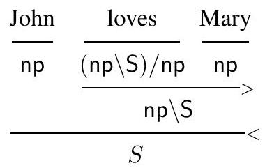

# Advanced Topics

本章讨论若干与 MTT 语义相关的高级议题：断言式解释的命题化（对第 3.2.3 节的正式化）、依赖事件类型（Dependent Event Types，DET；为 Davidson 式事件语义提供精细事件类型），以及依赖范畴语法（Dependent Categorial Grammars，DCG；带依赖类型的 Lambek 风格范畴语法）。三部分彼此独立，可分别阅读。

## Propositional forms of judgmental interpretations: formal treatment

如第 3.2.3 节所述，在 MTT 语义中，经常需要把“断言式”（judgmental）解释转为命题，以便组合更大的句法/语义结构。典型情形包括（下列编号均引自第 3.2.3 节，第 62–64 页）：

- 可推导的断言（如 (3.62)）；
- 否定环境下“不可推导”的断言（如 (3.66)、(3.67)）；
- 否定环境下“类型不匹配”的应用（如 (3.79)、(3.82)）。

这些断言式解释都有相应的“命题形式”。本节在第 3.2.3 节的非正式介绍基础上，给出更精确的处理（参见 Xue et al., 2018, 2020；Chatzikyriakidis & Luo, 2017b），细节可见所引论文。[^1]

[^1]: 本节采用非归谓（predicative）类型理论 UTT（Luo 1994）。若改用归谓系统，可将全体 $Prop$ 替换为若干归谓宇宙（例如 Luo 2018a 的系统 $\mathrm{MLTT}_h$），可得到平行结果。

思路如下：先引入“真谓词”$p_A$，把可推导的成员断言 $a:A$ 命题化为 $p_A(a)$。再处理否定环境下的两类现象——“不可推导断言”和“类型错误应用”。为此定义一组运算：基本的 $\mathrm{\small NOT}$ 以及由之导出的 $\mathrm{\small IS}$、$\mathrm{\small DO}$。在形式系统中，$\mathrm{\small NOT}$ 以公理方式引入；其所有非公理性质（法则）将借助“异构相等”（heterogeneous equality）来证明（McBride 2002；McBride & McKinna 2004）。最后讨论在何种条件下使用 $\mathrm{\small IS}$ 和 $\mathrm{\small DO}$ 不会造成过度生成（overgeneration）。

### 可推导断言的命题化

当断言 $a:A$ 可推导时，用 $p_A(a)$ 表示它的命题形式，其中对任一类型 $A$ 引入“真谓词”：

(7.1) $p_A: A \rightarrow Prop$

并规定对任意 $x:A$ 有：

(7.2) $p_A(x)=\mathbf{true}$

例如，把 (3.62)（此处重引为 (7.3)）命题化为 (7.4)，其中 $p_{\text{Human}}(j)$ 即断言 $j:\text{Human}$ 的命题形式：

(7.3) $\text{John is a human and he is happy.}$

(7.4) $p_{\text{Human}}(j)\ \wedge\ \mathrm{happy}(j)$

要点：$p_A(a)$ 的良类型性预设了 $a:A$，因此它不等同于无条件的 $\mathbf{true}$。也正因它“携带”$a:A$ 这一信息，$p_A(a)$ 才能扮演 $a:A$ 的命题等价物。

### 由 $\mathrm{\small NOT}$ 导出 $\mathrm{\small IS}$ 与 $\mathrm{\small DO}$

在否定语境里，某些“不可推导”的断言或“类型不匹配”的应用是有表达价值的（见 (3.66)、(3.67)、(3.79)、(3.82)）。为统一处理，引入运算 $\mathrm{\small NOT}$，其类型为：

(7.5) $\mathrm{\small NOT}: \Pi X:\mathsf{CN}\ \Pi p:X\rightarrow Prop\ \Pi Y:\mathsf{CN}\ \Pi y:Y.\ Prop$

直观读法：$\mathrm{\small NOT}(A,p,B,b)$ 表示 “$b$ does not $p$”。当 $p=p_A$（即 $A$ 的真谓词）时，读作 “$b$ 不是一个 $A$”。

以 $\mathrm{\small NOT}$ 为基，将以下两个运算定义为缩写（$A,B:\mathsf{CN}$）：

(7.6) $\mathrm{\small IS}_B:\ \mathsf{CN}\ \rightarrow\ B\ \rightarrow\ Prop$

(7.7) $\mathrm{\small IS}_B(X,y)\ =\ \neg\ \mathrm{\small NOT}(X,p_X,B,y)$

(7.8) $\mathrm{\small DO}_{A,B}:\ (A\rightarrow Prop)\ \rightarrow\ B\ \rightarrow\ Prop$

(7.9) $\mathrm{\small DO}_{A,B}(p,y)\ =\ \neg\ \mathrm{\small NOT}(A,p,B,y)$

常用时略去下标，记作 $\mathrm{\small IS}(X,y)$ 与 $\mathrm{\small DO}(p,y)$，分别读作 “$y$ 是 $X$” 与 “$y$ 做/具有 $p$”。第 3.2.3 节中 (3.71)/(3.66)、(3.72)/(3.67)、(3.81)/(3.79)、(3.84)/(3.82) 即可用本节记法对齐。[^2]

[^2]: 在 Xue et al. (2018) 的记号里（定义 3.1），命题 $P_{A,B}:B\to Prop$ 与此处的一致：$P_{A,B}(t)=\mathrm{\small IS}_B(A,t)$。

### $\mathrm{\small NOT}$ 的公理法则与直观版

把 $\mathrm{\small NOT}$ 作为新原语时，用以下法则（$A_1$–$A_5$）约束它的行为。此处 $A,B,C:\mathsf{CN}$，且 $A\preceq B$ 表示存在单射 $c:A\hookrightarrow B$（即 $c(x_1)=c(x_2)\Rightarrow x_1=x_2$）。

$\left(A_{1}\right)\quad \forall p:A\to Prop.\ \forall x:A.\ \neg\,\mathrm{\small NOT}(A,p,A,x)\ \Leftrightarrow\ p(x)$

$\left(A_{2}\right)\quad \forall p,q:A\to Prop.\ \bigl[\forall x:A.\ p(x)\Rightarrow q(x)\bigr]\ \Rightarrow\ \bigl[\forall y:B.\ \mathrm{\small NOT}(A,q,B,y)\Rightarrow \mathrm{\small NOT}(A,p,B,y)\bigr]$

$\left(A_{3}\right)\quad A\preceq B\ \Rightarrow\ \forall p:B\to Prop.\ \forall z:C.\ \mathrm{\small NOT}(B,p,C,z)\Rightarrow \mathrm{\small NOT}(A,p,C,z)$

$\left(A_{4}\right)\quad A\preceq B\ \Rightarrow\ \forall p:C\to Prop.\ \bigl[\forall y:B.\ \mathrm{\small NOT}(C,p,B,y)\bigr]\ \Rightarrow\ \bigl[\forall x:A.\ \mathrm{\small NOT}(C,p,A,x)\bigr]$

$\left(A_{5}\right)\quad A\preceq B\ \Rightarrow\ \forall p:C\to Prop.\ \bigl[\exists x:A.\ \mathrm{\small NOT}(C,p,A,x)\bigr]\ \Rightarrow\ \bigl[\exists y:B.\ \mathrm{\small NOT}(C,p,B,y)\bigr]$

若改用 $\mathrm{\small DO}$ 的记号，更易直读（$A_1^d$–$A_5^d$）。例如 $A_1$/$A_1^d$ 表示：当 $x:A$ 时，$\mathrm{\small DO}_{A,A}(p,x)$ 与 $p(x)$ 等价；特设 $p=p_A$ 时，$\mathrm{\small IS}(A,x)$ 与 $p_A(x)$ 等价。

$\left(A_{1}^{d}\right)\quad \mathrm{\small DO}_{A,A}(p,x)\ \Leftrightarrow\ p(x)$

$\left(A_{2}^{d}\right)\quad \bigl[\forall x:A.\ p(x)\Rightarrow q(x)\bigr]\ \Rightarrow\ \bigl[\forall y:B.\ \mathrm{\small DO}(p,y)\Rightarrow \mathrm{\small DO}(q,y)\bigr]$

$\left(A_{3}^{d}\right)\quad A\preceq B\ \Rightarrow\ \mathrm{\small DO}_{A,C}(p,z)\Rightarrow \mathrm{\small DO}_{B,C}(p,z)$

$\left(A_{4}^{d}\right)\quad A\preceq B\ \Rightarrow\ \forall y:B.\ \neg\,\mathrm{\small DO}_{C,B}(p,y)\ \Rightarrow\ \forall x:A.\ \neg\,\mathrm{\small DO}_{C,A}(p,x)$

$\left(A_{5}^{d}\right)\quad A\preceq B\ \Rightarrow\ \bigl[\exists x:A.\ \neg\,\mathrm{\small DO}_{C,A}(p,x)\bigr]\ \Rightarrow\ \bigl[\exists y:B.\ \neg\,\mathrm{\small DO}_{C,B}(p,y)\bigr]$

下面用配对的例句说明每条法则；带撇号的为其 $\mathrm{\small DO}$ 版：

(1) $\ \text{John is not a man.}$

$(1')\ \neg\,p_{\text{Man}}(j)\ \Leftrightarrow\ \neg\neg\,\mathrm{\small NOT}(\text{Man},p_{\text{Man}},\text{Man},j)\ =\ \neg\,\mathrm{\small IS}(\text{Man},j)$，其中 $j:\text{Man}$。

(2) $\ \text{If a table doesn't talk, then it doesn't talk loudly.}$

$(2')\ \forall t:\text{Table}.\ \neg\,\mathrm{\small DO}(\text{talk},t)\ \Rightarrow\ \neg\,\mathrm{\small DO}(\text{talk\_loudly},t)$，其中 $\text{talk},\text{talk\_loudly}:\text{Human}\to Prop$，且 $\forall h.\ \text{talk\_loudly}(h)\Rightarrow \text{talk}(h)$。

(3) $\ \text{If Teddy is a man, then Teddy is a human.}$

$(3')\ \mathrm{\small IS}(\text{Man},\text{Teddy})\ \Rightarrow\ \mathrm{\small IS}(\text{Human},\text{Teddy})$，其中 $\text{Teddy}:\text{Toy}$ 且 $\text{Man}\preceq \text{Human}$。

(4) $\ \text{If tables do not talk, then red tables do not talk, either.}$

$(4')\ [\forall t:\text{Table}.\ \neg\,\mathrm{\small DO}(\text{talk},t)]\ \Rightarrow\ [\forall r:\text{RTable}.\ \neg\,\mathrm{\small DO}(\text{talk},r)]$，其中 $\text{talk}:\text{Human}\to Prop$，$\text{RTable}=\Sigma(\text{Table},\text{red})\preceq \text{Table}$。[^3]

(5) $\ \text{Since not every linguist is a logician, not every human is a logician.}$

$(5')\ [\neg\,\forall l:\text{Linguist}.\ \mathrm{\small IS}(\text{Logician},l)]\ \Rightarrow\ [\neg\,\forall h:\text{Human}.\ \mathrm{\small IS}(\text{Logician},h)]$，其中 $\text{Linguist}\preceq \text{Human}$。

[^3]: 这里用单射强制把 $\Sigma(\text{Table},\text{red})$ 作为 $\text{Table}$ 的子类型，基于“证明不可区分”（proof irrelevance）：对 $red:\text{Table}\to Prop$ 与任意 $x,y:\text{Table}$，有 $\mathrm{red}(x)=\mathrm{red}(y)$。详见 Luo (2012a, 2018a)。

### 以异构相等（heterogeneous equality）证明一致性

$\mathrm{\small NOT}$ 作为原语，引入后系统是否一致？答案是肯定的。思路是：选取一个已知一致的扩展 $E$ 加到基础理论 $T$ 上，在 $T+E$ 中**定义** $\mathrm{\small NOT}$ 并**证明**上面的法则，从而说明 $T+\mathrm{\small NOT}$ 一致。合适的 $E$ 可取 McBride 的异构相等 $\mathrm{JMeq}$（McBride 2002；McBride & McKinna 2004）。[^4]

[^4]: $\mathrm{JMeq}$ 即 John Major equality。

$\mathrm{JMeq}$ 的类型为：

(7.10) $\mathrm{JMeq}:\ \Pi A:Type\ \Pi x:A\ \Pi B:Type\ \Pi y:B.\ Prop$

直观读法：$\mathrm{JMeq}(A,a,B,b)$ 断言 $a$ 与 $b$ 相等，尽管 $A$ 与 $B$ 或异。基于它，可给出 $\mathrm{\small NOT}$ 的定义：

(7.11) $\mathrm{\small NOT}(A,p,B,b)\ =\ \forall x:A.\ \mathrm{JMeq}(A,x,B,b)\ \Rightarrow\ \neg\,p(x)$

容易验证：在 $T+\mathrm{JMeq}$ 中，上述 $\left(A_i\right)$ 全部可证；因而 $T+\mathrm{\small NOT}$ 一致。

**定理 7.1.** 若按 (7.11) 定义 $\mathrm{\small NOT}$，则在扩展了 $\mathrm{JMeq}$ 的类型理论中，$\left(A_i\right)$（$i=1,\dots,5$）均可证明。

### 避免过度生成：类型不相交与“负面出现”

虽然 $\mathrm{\small IS}/\mathrm{\small DO}$ 能赋予“不可推导断言/类型错误应用”以否定语义，但并非可以任意使用，否则会过度生成。例如，下列句子通常无意义（非虚构语境）：

(7.12) (\#) $\text{John is a table.}$

(7.13) (\#) $\text{Tables talk.}$

对应的断言/应用：

(7.14) $j:\text{Table}$

(7.15) $\forall t:\text{Table}.\ \text{talk}(t)$（其中 $\text{talk}:\text{Human}\to Prop$）

不应用

(7.16) $\mathrm{\small IS}(\text{Table},j)$

(7.17) $\forall t:\text{Table}.\ \mathrm{\small DO}(\text{talk},t)$

去解释 (7.12)/(7.13)。为刻画“何时可用”，需要两点约束：**类型不相交**与**负面出现**。

**定义 7.1（类型不相交）** 若不存在非空类型 $C$ 使 $C\le A$ 且 $C\le B$，则称 $A$ 与 $B$ 互斥。  
例如 $Man$ 与 $Woman$、$Human$ 与 $Table$ 可视为互斥对。若 $j:Man$，则 $j:Table$、$j:Woman$ 都是不可推导断言——这恰依赖于不相交的假设。

再看“类型错误应用”：若 $\text{talk}:\text{Human}\to Prop$ 而 $t:\text{Table}$，则 $\text{talk}(t)$ 是错误输入。一般也应判为无意义。若在互斥前提下仍用

(7.19) (\#) $\mathrm{\small IS}(\text{Woman},j)$（其中 $j:Man$）

(7.21) (\#) $\forall t:\text{Table}.\ \mathrm{\small DO}(\text{talk},t)$

去解释

(7.18) (\#) $\text{John is a woman.}$

(7.20) (\#) $\text{Tables talk.}$

就会过度生成。

**负面出现（negative occurrence）** 用以限定 $\mathrm{\small IS}/\mathrm{\small DO}$ 的使用位置。先用“不良形式表达式”（ill-formed expression, IFE）作技术支撑：

1) 不可推导的断言是 IFE；  
2) 类型错误的应用是 IFE；  
3) 若 $A$ 或 $B$ 为 IFE，则 $A\wedge B$、$A\vee B$ 为 IFE；  
4) 若 $A$ 为 IFE，则 $\forall x:T.\ A$ 与 $\exists x:T.\ A$ 也为 IFE。

**定义 7.2（负面出现）** 设 $A,B,C$ 的形态为 $P_1\oplus\cdots\oplus P_n$（$P_i$ 原子公式，$\oplus\in\{\wedge,\vee\}$，$n\ge 1$）。则：

- 在 $\neg A$ 中，$A$ 及其子式均为负面出现；  
- 在 $A\Rightarrow B$ 中，$A$ 及其子式为负面出现；  
- 若 $A$ 为 IFE，则在 $A\Rightarrow B$ 中，$B$ 及其子式为负面出现；  
- 若某子式在 $A$ 中为负面出现，则它在 $\forall x:T.\ A$、$\exists x:T.\ A$ 中亦为负面出现；  
- 若某公式在 $A\Rightarrow B\Rightarrow C$ 中为负面出现，则它在 $A\wedge B\Rightarrow C$ 中亦为负面出现。

据此，以下用法是合法的（不会过度生成）：

(7.22) $\text{Women are not men.}$

(7.23) $\forall x:\text{Woman}.\ \neg\,\mathrm{\small IS}(\text{Man},x)$

(7.24) $\text{Tables do not talk.}$

(7.25) $\forall x:\text{Table}.\ \neg\,\mathrm{\small DO}(\text{talk},x)$

(7.26) $\text{If tables talk, so do chairs.}$

(7.27) $\bigl[\forall x:\text{Table}.\ \mathrm{\small DO}(\text{talk},x)\bigr]\ \Rightarrow\ \bigl[\forall y:\text{Chair}.\ \mathrm{\small DO}(\text{talk},y)\bigr]$

这些式子要么直接处于否定之下，要么处于蕴含左侧等负面位置，因而可用 $\mathrm{\small IS}/\mathrm{\small DO}$ 对不可推导断言或类型不匹配应用进行“否定化”的命题化，而不致引入不恰当的正面承诺。

## Dependent event types

事件语义自 Davidson（1967）提出以来，经过 Parsons（1990）等人的“新 Davidson”路线发展，已成为处理副词修饰等现象的强力工具。依赖类型能进一步细化事件语义的类型结构。本节概述 **依赖事件类型**（Dependent Event Types, **DET**；Luo & Soloviev 2017, 2020）如何在 Montagovian 设定中提供更充分的解释（关于在 MTT 设定中如何使用 DET，请见 Luo & Soloviev 2017, 2020）。

**Davidson 式事件语义。** 引入事件的经典动机是解释副词修饰。考虑：

(7.28) $\text{John buttered the toast.}$

(7.29) $\text{John buttered the toast with the knife in the kitchen.}$

在传统 Montagovian 语义中，令 $butter:\mathbf{e}\to \mathbf{e}\to \mathbf{t}$，$with\_knife,\ in\_kitchen:(\mathbf{e}\to \mathbf{t})\to \mathbf{e}\to \mathbf{t}$，可分别给出：

(7.30) $butter(j,\ toast)$

(7.31) $in\_kitchen\bigl(with\_knife(butter(j))\bigr)(\text{toast})$

要从 (7.31) 推出 (7.30)，需假设任意 $f\in\{with\_knife,\ in\_kitchen\}$ 均满足 $f(p,x)\Rightarrow p(x)$。这是生硬的“意义假设”。

Davidson（1967）改以**事件**为核心：动词暗含对事件的存在量化，动词与状语短语都是对事件的谓词。新 Davidson 式写法中，引入主题角色函数 $agent, patient: Event\to \mathbf{e}$。令 $j,t$ 分别是 “John”“the toast” 的释义，则：

(7.32) $\exists v:Event.\ butter(v)\ \wedge\ agent(v)=j\ \wedge\ patient(v)=t$

(7.33) $\exists v:Event.\ butter(v)\ \wedge\ agent(v)=j\ \wedge\ patient(v)=t\ \wedge\ with\_knife(v)\ \wedge\ in\_kitchen(v)$

此时 (7.33) 显然蕴含 (7.32)，无需额外假设。[^5][^6]

[^5]: 多数写法省略类型标注，直接写 $\exists v.\ butter(v)\wedge \cdots$，默认 $v$ 取自事件域；至于 $Event$ 是否是实体域 $\mathbf{e}$ 的子类型（即 $Event\le \mathbf{e}$），本文不作限定。

[^6]: 事件语义还带来副词次序的可交换性（Landman 2000），否则需再引入语义约束。

不过，引入事件量词也带来**事件量化问题**（Event Quantification Problem, **EQP**）：事件量词与其他量词的相互作用可能产生不当作用域。例：

(7.34) $\text{Nobody talked.}$

若 $talk:Event\to \mathbf{t}$，直观的新 Davidson 语义为：

(7.35) $\neg\,\exists x:\mathbf{e}.\ \bigl[human(x)\ \wedge\ \exists v:Event.\ talk(v)\ \wedge\ agent(v)=x\bigr]$

但也可“提升”事件量词：

(7.36) (\#) $\exists v:Event.\ \neg\,\exists x:\mathbf{e}.\ human(x)\ \wedge\ talk(v)\ \wedge\ agent(v)=x$

(7.36) 直觉上不该是 (7.34) 的语义，却在形式上并非不合法。现有解法或过于特设，或增加复杂度（如 Landman 1996 的非正式 Scope Domain Principle；Champollion 2015 的事件集机制）。[^7]

[^7]: 这些方案要么依赖非语法化的范围限制原则，要么显著增加事件结构的复杂度，其与直觉和可组合性之间的关系并不清晰。

**依赖事件类型（DET）。** 传统设定只有一个事件类型 $Event$。例如：

(7.37) $\text{John talked loudly.}$

(7.38) $\exists v:Event.\ talk(v)\ \wedge\ loud(v)\ \wedge\ agent(v)=j$

我们提出用 **依赖** 的事件类型细分事件域：引入依赖于参数（常为主题角色）的事件类型 $Evt$。若 $a:Agent$，则 $Evt_A(a)$ 表示“施事为 $a$ 的事件”的类型。于是：

(7.39) $\exists v:Evt_A(j).\ talk(v)\ \wedge\ loud(v)$

此时 $talk(v),\ loud(v)$ 均良类型（$Evt_A(j)\le Event$）。并且可恢复主题信息：对任意 $a:Agent$，可定义 $\mathrm{\small AGENT}_A[a]$ 使得 $\forall v:Evt_A(a).\ \mathrm{\small AGENT}_A[a](v)=a$。

一般地，可考虑 $n$ 元 DET，由参数类型 $A_1,\ldots,A_n$ 索引。本文聚焦 $n=0,1,2$ 三类：（i）$n=0$：$Event$（无参，传统全体事件类型）；（ii）$n=1$：$Evt_A(a)$、$Evt_P(p)$，分别依赖施事 $a$ 或受事 $p$；（iii）$n=2$：$Evt_{AP}(a,p)$，同时依赖施事与受事（如 $Evt_{AP}(j,m)$）。也可把**方式**、**说话者**等作参数，得到如 $Evt_{AM}(a,m)$、$Evt_{UM}(u,m)$（参见第 4 章）。

这些事件类型之间有自然的子类型关系：

(7.40) $Evt_{AP}(a,p)\ \le\ Evt_A(a)\ \le\ Event,\quad Evt_{AP}(a,p)\ \le\ Evt_P(p)\ \le\ Event$

如下图所示（图 7.1）。

> 图 7.1　由施事/受事参数化的 DET 之间的子类型关系

**DET 化解 EQP。** 在带 DET 的 Montagovian 系统（记为 $\mathcal{C}_e$）中，(7.34) 的语义可写为：

(7.41) $\neg\,\exists x:\mathbf{e}.\ \bigl[human(x)\ \wedge\ \exists v:Evt_A(x).\ talk(v)\bigr]$

而把事件量词“外提”会得到：

(7.42) (\#) $\exists v:Evt_A(x).\ \neg\,\exists x:\mathbf{e}.\ human(x)\ \wedge\ talk(v)$

(7.42) **类型非法**：$x$ 在 $Evt_A(x)$ 中是自由未束缚的（越界），故整个式子不合格。对比无 DET 的传统写法，(7.36) 仍是良类型、无法形式排除。我们主张：DET 以类型纪律**自然**排除了不当作用域，是对 EQP 的干净解法。[^8]

[^8]: DET 亦方便处理事件语义中的选择限制（selectional restrictions），尤其在 MTT 框架下（Luo 2018a）。

**$\mathcal{C}_e$：在 Montagovian 框架中加入 DET。** DET 既可并入简单类型理论（Church’s STT，记 $\mathcal{C}$），也可并入 MTT（见 Luo & Soloviev 2017）。本文聚焦前者，并给出扩展系统 $\mathcal{C}_e$ 的规则与保守性结果。

**（1）继承 $\mathcal{C}$ 的规则。** $\mathcal{C}_e$ 包含 $\mathcal{C}$ 的所有推理规则（见第 1.3.1 节与附录 A1.1）。唯一变化：$\lambda$ 规则增加边界条件，防止依赖出现时的非法抽象：

$$
\frac{\Gamma,\ x:A\ \vdash\ b:B\qquad x\notin FV(B)}
     {\Gamma\ \vdash\ \lambda x\!:\!A.\ b:\ A\to B}
$$

在 $\mathcal{C}$ 中无需该条件（无依赖类型，$x$ 不会自由出现于 $B$）。

**（2）主题角色与 DET 的形成规则。**
$$
\begin{aligned}
&\frac{\Gamma\ \text{valid}}{\Gamma\vdash Agent\ \text{type}}\qquad
 \frac{\Gamma\ \text{valid}}{\Gamma\vdash Patient\ \text{type}}\qquad
 \frac{\Gamma\ \text{valid}}{\Gamma\vdash Event\ \text{type}}\\[4pt]
&\frac{\Gamma\vdash a:Agent}{\Gamma\vdash Evt_A(a)\ \text{type}}\qquad
 \frac{\Gamma\vdash p:Patient}{\Gamma\vdash Evt_P(p)\ \text{type}}\qquad
 \frac{\Gamma\vdash a:Agent\quad \Gamma\vdash p:Patient}{\Gamma\vdash Evt_{AP}(a,p)\ \text{type}}
\end{aligned}
$$

**（3）包含（subsumption）规则。**
$$
\frac{\Gamma\vdash a:A\qquad \Gamma\vdash B\ \text{type}\qquad A\le B}
     {\Gamma\vdash a:B}
$$

其中子类型关系 $\le$ 是相对于转换 $\simeq$（见第 8 页脚注 10）的最小偏序，满足：① 箭头类型**逆变/协变**：若 $A'\le A$ 且 $B\le B'$，则 $A\to B\ \le\ A'\to B'$；② DET 的子类型关系如 (7.40)（见图 7.1）。[^9]

**定理 7.2（保守性）。** $\mathcal{C}_e$ 是 $\mathcal{C}$ 的保守扩展。

*证明思路.* 定义映射 $R:\mathcal{C}_e\to \mathcal{C}$：把 $Agent, Patient, Event, Evt_{\bar K}(\bar k)$ 同态映到 $\mathbf{e}$；不含这些类型的项按原样映射（递归定义）。可验证 $R$ 保持可导性：任一 $\mathcal{C}_e$ 推导 $D$，其像 $R(D)$ 是 $\mathcal{C}$ 的推导。又 $R$ 在任一 $\mathcal{C}$ 判断上为恒等，故若某 $\mathcal{C}$ 判断在 $\mathcal{C}_e$ 中可导，则亦在 $\mathcal{C}$ 中可导，故为保守扩展。

**推论 7.1（相容性）。** $\mathcal{C}_e$ 逻辑上一致。

[^9]: 在 Montagovian 设定下，DET 间的子类型关系按集合包含理解。

## Dependent event types

自 Davidson（1967）提出事件语义以来，经 Parsons（1990）等发展出的“新 Davidson”路线，使其成为解释副词修饰等现象的有力框架。依赖类型可以进一步细化事件的类型结构。下文概述 **依赖事件类型**（Dependent Event Types, **DET**；Luo & Soloviev 2017, 2020）如何在 Montagovian 设定中给出更到位的解释（在 MTT 框架下如何配合 DET，见 Luo & Soloviev 2017, 2020）。

**Davidson 式事件语义。** 引入事件的经典动机是处理副词修饰。看：

(7.28) $ \text{John buttered the toast.} $

(7.29) $ \text{John buttered the toast with the knife in the kitchen.} $

在传统 Montagovian 设定下，取 $butter:\mathbf{e}\to \mathbf{e}\to \mathbf{t}$，$with\_knife,\ in\_kitchen:(\mathbf{e}\to \mathbf{t})\to \mathbf{e}\to \mathbf{t}$，可分别释为：

(7.30) $ butter(j,\ toast) $

(7.31) $ in\_kitchen\bigl(with\_knife(butter(j))\bigr)(toast) $

要由 (7.31) 推出 (7.30)，需假设任意 $f\in\{with\_knife,\ in\_kitchen\}$ 均满足 $f(p,x)\Rightarrow p(x)$，这属于牵强的“意义假设”。

Davidson（1967）将**事件**置于核心：动词隐含对事件的存在量化；动词与状语短语都是事件谓词。新 Davidson 写法中，用主题角色函数 $agent, patient:Event\to \mathbf{e}$。令 $j,t$ 分别为 “John”“the toast” 的释义，则：

(7.32) $ \exists v:Event.\ butter(v)\wedge agent(v)=j \wedge patient(v)=t $

(7.33) $ \exists v:Event.\ butter(v)\wedge agent(v)=j \wedge patient(v)=t \wedge with\_knife(v)\wedge in\_kitchen(v) $

此时 (7.33) 明显蕴含 (7.32)，不再需要额外假设。[^5][^6]

[^5]: 通常省略类型标注，直接写 $\exists v.\ butter(v)\wedge\cdots$，默认 $v$ 取自事件域；至于 $Event$ 是否为实体域 $\mathbf{e}$ 的子类型（即 $Event\le \mathbf{e}$），本文不作限定。

[^6]: 事件语义还支持副词次序可交换（Landman 2000）；否则需另加语义约束。

但事件量词也引发**事件量化问题**（Event Quantification Problem, **EQP**）：与其他量词的相互作用可能出现不当作用域。例：

(7.34) $ \text{Nobody talked.} $

若 $talk:Event\to \mathbf{t}$，直观的新 Davidson 语义为：

(7.35) $ \neg\,\exists x:\mathbf{e}.\bigl[human(x)\wedge \exists v:Event.\ talk(v)\wedge agent(v)=x\bigr] $

还可把事件量词“外提”：

(7.36) (\#) $ \exists v:Event.\ \neg\,\exists x:\mathbf{e}.\ human(x)\wedge talk(v)\wedge agent(v)=x $

(7.36) 直觉上不应对应 (7.34)，却在形式上并非不合法。已有方案或过于特设，或结构复杂（如 Landman 1996 的非正式 Scope Domain Principle；Champollion 2015 的事件集机制）。[^7]

[^7]: 或依靠非语法化的范围限制原则，或显著增加事件结构复杂度，其与直觉和可组合性的关系并不清晰。

**依赖事件类型（DET）。** 传统设定只有 $Event$ 一种事件类型。例如：

(7.37) $ \text{John talked loudly.} $

(7.38) $ \exists v:Event.\ talk(v)\wedge loud(v)\wedge agent(v)=j $

我们改用**依赖**的事件类型细分事件域：按参数（常为主题角色）索引的 $Evt$。若 $a:Agent$，$Evt_A(a)$ 表示“施事为 $a$ 的事件”的类型，于是：

(7.39) $ \exists v:Evt_A(j).\ talk(v)\wedge loud(v) $

此时 $talk(v)$、$loud(v)$ 均良类型（$Evt_A(j)\le Event$）。还可回收主题信息：对任意 $a:Agent$，定义 $\mathrm{\small AGENT}_A[a]$ 使得 $\forall v:Evt_A(a).\,\mathrm{\small AGENT}_A[a](v)=a$。

一般地，$n$ 元 DET 由参数类型 $A_1,\ldots,A_n$ 索引。本文聚焦 $n=0,1,2$：（i）$n=0$：$Event$（全体事件）；（ii）$n=1$：$Evt_A(a)$、$Evt_P(p)$（依赖施事或受事）；（iii）$n=2$：$Evt_{AP}(a,p)$（同时依赖施事与受事，如 $Evt_{AP}(j,m)$）。也可将**方式**、**说话者**等作为参数，得到 $Evt_{AM}(a,m)$、$Evt_{UM}(u,m)$（见第 4 章）。

这些事件类型之间有自然的子类型关系：

(7.40) $ Evt_{AP}(a,p)\le Evt_A(a)\le Event,\quad Evt_{AP}(a,p)\le Evt_P(p)\le Event $

如下图所示（图 7.1）。

> 图 7.1　由施事/受事参数化的 DET 的子类型关系

**DET 化解 EQP。** 在带 DET 的 Montagovian 系统（记 $\mathcal{C}_e$）中，(7.34) 可释为：

(7.41) $ \neg\,\exists x:\mathbf{e}.\bigl[human(x)\wedge \exists v:Evt_A(x).\ talk(v)\bigr] $

而把事件量词“外提”会得到：

(7.42) (\#) $ \exists v:Evt_A(x).\ \neg\,\exists x:\mathbf{e}.\ human(x)\wedge talk(v) $

(7.42) **类型非法**：$x$ 在 $Evt_A(x)$ 中自由未束缚（越界），式子不合格。对比无 DET 的传统写法，(7.36) 仍是良类型，难以形式排除。DET 以类型纪律**自然**排除了不当作用域，是对 EQP 的干净解法。[^8]

[^8]: DET 亦便于在事件语义中处理选择限制（selectional restrictions），尤其在 MTT 框架下（Luo 2018a）。

**$\mathcal{C}_e$：在 Montagovian 中加入 DET。** DET 可并入简单类型理论（Church’s STT，记 $\mathcal{C}$）或 MTT（见 Luo & Soloviev 2017）。本文聚焦前者，并给出扩展 $\mathcal{C}_e$ 的规则与保守性结论。

**（1）继承 $\mathcal{C}$ 规则。** $\mathcal{C}_e$ 包含 $\mathcal{C}$ 的全部推理规则（见第 1.3.1 节与附录 A1.1）。唯一变化是 $\lambda$ 规则增加边界条件，避免依赖造成的非法抽象：
$$
\frac{\Gamma,\ x:A\ \vdash b:B\qquad x\notin FV(B)}
     {\Gamma\ \vdash\ \lambda x\!:\!A.\ b:\ A\to B}
$$
在 $\mathcal{C}$ 中无需该条件（无依赖类型）。

**（2）主题角色与 DET 的形成。**
$$
\begin{aligned}
&\frac{\Gamma\ \text{valid}}{\Gamma\vdash Agent\ \text{type}}\quad
 \frac{\Gamma\ \text{valid}}{\Gamma\vdash Patient\ \text{type}}\quad
 \frac{\Gamma\ \text{valid}}{\Gamma\vdash Event\ \text{type}}\\[4pt]
&\frac{\Gamma\vdash a:Agent}{\Gamma\vdash Evt_A(a)\ \text{type}}\quad
 \frac{\Gamma\vdash p:Patient}{\Gamma\vdash Evt_P(p)\ \text{type}}\quad
 \frac{\Gamma\vdash a:Agent\ \ \Gamma\vdash p:Patient}{\Gamma\vdash Evt_{AP}(a,p)\ \text{type}}
\end{aligned}
$$

**（3）包含（subsumption）。**
$$
\frac{\Gamma\vdash a:A\qquad \Gamma\vdash B\ \text{type}\qquad A\le B}
     {\Gamma\vdash a:B}
$$

子类型 $\le$ 是相对于转换 $\simeq$（见第 8 页脚注 10）的最小偏序，满足：① 箭头类型**逆变/协变**：若 $A'\le A$ 且 $B\le B'$，则 $A\to B\ \le\ A'\to B'$；② DET 的子类型关系如 (7.40)（见图 7.1）。[^9]

**定理 7.2（保守性）。** $\mathcal{C}_e$ 是 $\mathcal{C}$ 的保守扩展。

*思路.* 定义 $R:\mathcal{C}_e\to \mathcal{C}$：将 $Agent, Patient, Event, Evt_{\bar K}(\bar k)$ 同态映到 $\mathbf{e}$；不含这些类型的项按原样映射（递归定义）。可验 $R$ 保持可导性：任一 $\mathcal{C}_e$ 推导 $D$，$R(D)$ 是 $\mathcal{C}$ 推导。且 $R$ 在任一 $\mathcal{C}$ 判断上为恒等，故若某 $\mathcal{C}$ 判断在 $\mathcal{C}_e$ 中可导，则亦在 $\mathcal{C}$ 中可导，因而为保守扩展。

**推论 7.1（相容性）。** $\mathcal{C}_e$ 逻辑上一致。

[^9]: 在 Montagovian 设定中，DET 的子类型关系按集合包含理解。

## Dependent categorial grammars

本节讨论如何在范畴语法中引入依赖类型。范畴语法建立在子结构演算（如 Lambek 演算）之上，因此关键是：能否与依赖类型结合、如何获得依赖型 Lambek 类型。第二作者对**依赖子结构类型**进行了研究，特别是 DCG（Dependent Categorial Grammars）中的依赖 Lambek 类型，展示了它们如何对应到 MTT-语义的类型，这是推进 DCG 基础的可行路径。我们将说明如何引入 Lambek 风格的 $\Pi$、$\Sigma$ 依赖类型，并讨论其在语义构造中的作用。需要说明，本文的一些想法仍处于探索阶段，尚待进一步验证与发展。

先从“名词即类型”的非依赖版本谈起，看当把名词当作类型（而非谓词）时，范畴语法的句法/语义对应会发生什么。由此可以在**选择限制**和**句法限制**上获得新选项：既可以同时收紧句法与语义，也可以只收紧语义。前者使类别错误的句子在句法与语义上都不通过；后者则允许句法良构但语义失败。随后，我们引入带依赖的 Lambek 演算（Luo 2015）：在原有类型构造子基础上，再加入**定向依赖积**（$\Pi^{r}, \Pi^{l}$）与**定向依赖和**（$\Sigma^{\sim}, \Sigma^{\circ}$）。我们用 $\Pi$ 型分析涉及量词与副词的句子，用定向 $\Sigma$ 型联接形容词修饰与位置（前置/后置）之间的语义差异，进而触及个体级（individual-level）/阶段级（stage-level）对比。

**范畴语法简史。** 范畴语法是一族高度词汇化的形式系统：语言变异主要由词汇驱动，跨语言共性则由少量组合规则得出。通常将其系谱追溯到 Lambek（1958），更早可至 Ajdukiewicz（1935）、Bar-Hillel（1953），甚至 Russell 的类型理论、Frege 的函数观（Morrill 2011）。Ajdukiewicz 的系统没有方向信息，基础类型仅有 sentence 与 name，配一个**消去模式**：

(7.43) $ \dfrac{B}{A}\ A \Rightarrow B $

Lambek（1958）等引入了**方向**，把消去拆为：

(7.44) $ B/A,\ A \Rightarrow B $

(7.45) $ A,\ A\backslash B \Rightarrow B $
$$
\begin{array}{|l|l|}
\hline
\text{John}: \mathsf{np}\\
\text{Mary}: \mathsf{np}\\
\text{likes}: \mathsf{(np \backslash S)/np}\\
\hline
\end{array}
$$

> 表 7.1　方向性句法类型

基于表 7.1 的词典，“John loves Mary” 的推导如下：

随后加入 $\lambda$-语义（Van Benthem 1988; Moortgat 1988），形成句法—语义的系统映射。此后扩展众多，如 Steedman 的 CCG（Steedman 2000）、Kubota & Levine 的 HTLG（2015）、De Groote 的 ACG（2001）等；大规模解析亦多有实践。本文不涉及这些更灵活的系统，而聚焦为范畴语法配备依赖类型的思路。

为什么把依赖类型引入 Lambek 风格语法？对做依赖类型语义的人，它提供紧密的句法演算与句法/语义对应；对做范畴语法的人，它提供更精细的语义机制。这一方向虽鲜有系统实践，但已有零星讨论：Ranta（1998）提出将类型依赖性引入定向类型，用以表达量词；De Groote & Maarek（2007）在 ACG 中用依赖乘积扩展基础型，以特征索引化句法类别。第二作者提出的 Lambek 依赖类型（Luo 2015, 2018c）为本文提供了技术基底。

更一般地，**资源敏感类型**（如线性逻辑中的线性类型）与依赖类型的结合是重要而困难的课题（参见 Cervesato & Pfenning 2002；Krishnaswami 等 2015；Vákár 2015）。如何结合在很大程度上取决于应用动机与场景。[^10]

[^10]: 一个关键技术点是：是否允许类型依赖于 Lambek/线性变量（子结构变量）。若允许，系统复杂度会明显上升（见 Luo 2018c 的相关讨论）。

**CNs-as-types 范畴语法。** 当把名词视为**类型**（而非谓词）时，句法/语义的匹配会改变。表 7.2 对比了标准范畴语法与“名词即类型”的版本。两者的差异在于：标准版的语义语言是 MG；“名词即类型”版的语义类型系统在 MG 上加入多重排序与子类化。以专名为例：在“名词即类型”版中，“John”的句法类型为 $man$，语义类型为 $Man$；而在标准版中分别为 $\mathsf{np}$ 与 $\mathbf{e}$。对普通名词：该版的句法 $CN$ 直接对应语义宇宙 $\mathsf{CN}$，而标准版中 $N$ 是句法类，语义则为 $\mathbf{e}\to \mathbf{t}$。两者在**选择限制**上的后果立见：在标准版里，“War and Peace loves John” 可推导（7.46）；在“名词即类型”里会因类型不匹配而失败（7.47）。
$$
\begin{array}{|c|c|c|}
\hline
\text{Word} & \text{Standard CG} & \text{CNs-as-types CG}\\
\hline
\text{John} & \mathsf{np} & man\\
 & \mathbf{e} & Man\\
 & \mathsf{j} & j\\
\hline
\text{Mary} & \mathsf{np} & woman\\
 & \mathbf{e} & Woman\\
 & \mathsf{m} & m\\
\hline
\text{War and Peace} & \mathsf{np} & book\\
 & \mathbf{e} & Book\\
 & \mathsf{WaP} & WaP\\
\hline
\text{man} & \mathsf{n} & CN\\
 & \mathbf{e}\to \mathbf{t} & \mathsf{CN}\\
 & \lambda x:\mathbf{e}.\ man(x) & Man\\
\hline
\text{woman} & \mathsf{n} & CN\\
 & \mathbf{e}\to \mathbf{t} & \mathsf{CN}\\
 & \lambda x:\mathbf{e}.\ woman(x) & Woman\\
\hline
\text{love} & \mathsf{(np\backslash S)/np} & (animal\backslash S)/object\\
 & \mathbf{e}\to \mathbf{e}\to \mathbf{t} & Animal\to Object\to Prop\\
 & \lambda y:\mathbf{e}.\ love(x,y) & \lambda x:Object.\ \lambda y:Animal.\ love(x,y)\\
\hline
\end{array}
$$

> 表 7.2　标准范畴语法 vs. CNs-as-types 版：简单词项的句法/语义类型对照

(7.46) 

(7.47) 

二者间还有一种**中间方案**：允许此类句子在**句法上**良构，但在**语义上**失败。做法是：句法类型取更宽（如 $object$），语义类型仍严格（如 $Man$）。同理，$love$ 的句法类型设为 $(object\backslash S)/object$，语义类型为 $Object\to Animal\to Prop$。这样能得到良构解析但语义不当（7.48）。[^11]

(7.48) 

[^11]: 也可用更传统的 $\mathsf{np}$ 取代 $object$。句法/语义的粒度分工有多种可能，值得系统探索。

**引入依赖型 Lambek 类型。** 我们采用双区上下文：
$$
\Gamma;\ \Delta
$$
其中 $\Gamma$ 是直觉主义上下文（变量可自由复用），$\Delta$ 是 Lambek（有序）上下文。类型**仅**可依赖 $\Gamma$ 中的变量，不可依赖 $\Delta$ 中的 Lambek 变量。因为对象可出现在类型中，需要如下**类型等价规则**：
$$
\frac{\Gamma;\ \Delta\ \vdash a:A \quad \Gamma;*\ \vdash A=B}
     {\Gamma;\ \Delta\ \vdash a:B}
$$
上下文有效性与变量规则如下（末两式均要求 $x\notin FV(\Gamma,\Delta)$）：
$$
\frac{}{*;*\ \text{valid}}\qquad
\frac{\Gamma;\ \Delta\ \text{valid}\quad \Gamma;*\ \vdash A\ \text{type}}
     {(\Gamma,x:A);\ \Delta\ \text{valid}}\qquad
\frac{\Gamma;\ \Delta\ \text{valid}\quad \Gamma;*\ \vdash A\ \text{type}}
     {\Gamma;\ (\Delta,x:A)\ \text{valid}}
$$
$$
\frac{\Gamma,x:A,\Gamma';*\ \text{valid}}
     {\Gamma,x:A,\Gamma';*\ \vdash x:A}
\qquad
\frac{\Gamma;\ y:A\ \text{valid}}
     {\Gamma;\ y:A\ \vdash y:A}
$$

**定向 $/$ 类型的规则**（见图 7.2）：
$$
\begin{gathered}
\text{(/-F)}\ \ \frac{\Gamma;*\vdash A\ \text{type}\quad \Gamma;*\vdash B\ \text{type}}
                      {\Gamma;*\vdash B/A\ \text{type}}
\\[4pt]
\text{(/-I)}\ \ \frac{\Gamma;\ (\Delta,x:A)\vdash b:B \quad \Gamma;*\vdash B/A\ \text{type}}
                      {\Gamma;\ \Delta\ \vdash\ /x:A.\ b:\ B/A}
\\[4pt]
\text{(/-E)}\ \ \frac{\Gamma;\ \Delta_1\vdash f:B/A \quad \Gamma;\ \Delta_2\vdash a:A}
                      {\Gamma;\ (\Delta_1,\Delta_2)\ \vdash f\ a:B}
\\[4pt]
\text{(/-C)}\ \ \frac{\Gamma;\ (\Delta_1,x:A)\vdash b:B \quad \Gamma;\ \Delta_2\vdash a:A}
                      {\Gamma;\ (\Delta_1,\Delta_2)\ \vdash (/x:A.\ b)\ a = [a/x]b:\ B}
\end{gathered}
$$

> 图 7.2　定向 $B/A$ 的形成、引入、消去与计算

**定向依赖积（$\Pi$）。** 我们引入 $\Pi^{r}$ 与对偶的 $\Pi^{l}$（此处略去 $\Pi^{l}$，其项构造子为 $\lambda^{l}x:A.b$ 与 $app^{l}(a,f)$）。$\Pi^{r}$ 规则见图 7.3：
$$
\begin{gathered}
(\Pi^{r}\text{-F})\ \ \frac{\Gamma;*\vdash A\ \text{type}\ \ \Gamma,x:A;*\vdash B\ \text{type}}
                          {\Gamma;*\vdash \Pi^{r}x:A.\ B\ \text{type}}
\\[4pt]
(\Pi^{r}\text{-I})\ \ \frac{\Gamma,x:A;\ \Delta\ \vdash b:B \quad \Gamma;*\vdash \Pi^{r}x:A.\ B\ \text{type}}
                          {\Gamma;\ \Delta\ \vdash \lambda^{r}x:A.\ b:\ \Pi^{r}x:A.\ B}
\\[4pt]
(\Pi^{r}\text{-E})\ \ \frac{\Gamma;\ \Delta\ \vdash f:\Pi^{r}x:A.\ B \quad \Gamma;*\vdash a:A}
                          {\Gamma;\ \Delta\ \vdash app^{r}(f,a):[a/x]B}
\\[4pt]
(\Pi^{r}\text{-C})\ \ \frac{\Gamma,x:A;\ \Delta\ \vdash b:B \quad \Gamma;*\vdash a:A \quad \Gamma;*\vdash \Pi^{r}x:A.\ B\ \text{type}}
                          {\Gamma;\ \Delta\ \vdash app^{r}(\lambda^{r}x:A.\ b,\ a) = [a/x]b:\ [a/x]B}
\end{gathered}
$$

> 图 7.3　定向 $\Pi^{r}$

对比如下（表 7.3）。其中 $student$ 是 $animal$ 的子类型（因箭头逆变，$animal\backslash S \le student\backslash S$）。$S$ 对应语义宇宙 $Prop$。
$$
\begin{array}{|c|c|c|}
\hline
\text{WORD} & \text{Standard CG} & \text{Dependent Type CG}\\
\hline
\text{Every} & \mathsf{(S/(np\backslash S))/n} & \Pi^{r}X:CN.\ S/(X\backslash S)\\
 & (\mathbf{e}\to \mathbf{t})\to (\mathbf{e}\to \mathbf{t})\to \mathbf{t}
 & \Pi A:\mathsf{CN}.\ (A\to Prop)\to Prop\\
 & \lambda P,Q:\mathbf{e}\to \mathbf{t}.\ \forall x:\mathbf{e}.\ P(x)\Rightarrow Q(x)
 & \lambda A:\mathsf{CN}.\ \lambda P:A\to Prop.\ \forall x:A.\ P(x)\\
\hline
\text{Student} & \mathsf{n} & CN\\
 & \mathbf{e}\to \mathbf{t} & \mathsf{CN}\\
 & \lambda x:\mathbf{e}.\ student(x) & Student\\
\hline
\text{Walks} & \mathsf{np\backslash S} & animal\backslash S\\
 & \mathbf{e}\to \mathbf{t} & Animal\to Prop\\
 & \lambda x:\mathbf{e}.\ walk(x) & \lambda x:Animal.\ walk(x)\\
\hline
\end{array}
$$

> 表 7.3　依赖范畴语法与标准范畴语法的词汇对照

示例：

(7.49) $ \text{Every student walks.} $

其推导如 (7.50) 所示：
(7.50) 

类似地，可处理 VP 副词：句法类型为 $ \Pi^{r}X:CN.\ (X\backslash S)\backslash (X\backslash S)$（$X$ 约略隐含），语义类型为第 4 章所述 $ \Pi A:\mathsf{CN}.\ (A\to Prop)\to (A\to Prop)$。$\Pi$ 也可用于细分形容词语义，但需引入 **Lambek $\Sigma$**。

**定向依赖和（$\Sigma$）。** 我们区分**反向依赖和**（$\Sigma^{\sim}$）与**连接依赖和**（$\Sigma^{\circ}$）。$\Sigma^{\sim}$ 规则见图 7.4（$\Sigma^{\circ}$ 对偶省略）：
$$
\begin{gathered}
(\Sigma^{\sim}\text{-F})\ \ \frac{\Gamma;*\vdash A\ \text{type}\quad \Gamma,x:A;*\vdash B\ \text{type}}
                              {\Gamma;*\vdash \Sigma^{\sim}x:A.\ B\ \text{type}}\\[4pt]
(\Sigma^{\sim}\text{-I})\ \ \frac{\Gamma;*\vdash a:A\quad \Gamma;\ \Delta\ \vdash b:[a/x]B}
                              {\Gamma;\ \Delta\ \vdash pair(a,b):\Sigma^{\sim}x:A.\ B}\\[4pt]
(\Sigma^{\sim}\text{-E})\ \ \frac{\Gamma;\ \Delta\ \vdash p:\Sigma^{\sim}x:A.\ B \quad \Gamma,x:A;\ \Delta',y:B\ \vdash e:C \quad \Gamma;*\vdash C\ \text{type}}
                              {\Gamma;\ (\Delta,\Delta')\ \vdash\ \mathbf{let}\ pair(x,y)=p\ \mathbf{in}\ e:\ C}\\[4pt]
(\Sigma^{\sim}\text{-C})\ \ \frac{\Gamma;*\vdash a:A\ \ \Gamma;\ \Delta\ \vdash b:[a/x]B\ \ \Gamma,x:A;\ \Delta',y:B\ \vdash e:C\ \ \Gamma;*\vdash C\ \text{type}}
                              {\Gamma;\ (\Delta,\Delta')\ \vdash\ \mathbf{let}\ pair(x,y)=pair(a,b)\ \mathbf{in}\ e = [a/x,b/y]e:\ C}
\end{gathered}
$$

> 图 7.4　$\Sigma^{\sim}$ 的形成/引入/消去/计算

$\mathsf{CN}$ 对 $\Sigma^{\sim}$、$\Sigma^{\circ}$ 都封闭。依赖型 $\Sigma$ 在形容词修饰中尤为自然：定向 $\Sigma$ 能区分两种修饰方向：

(7.51) $ \text{diligent student} $

(7.52) $ \text{student who is diligent} $

设 $B:A\backslash S$，约记 $\Sigma^{\sim}(A,B)$ 为 $\Sigma^{\sim}x:A.\ (x\ B)$，$\Sigma^{\circ}(A,B)$ 为 $\Sigma^{\circ}x:A.\ (x\ B)$。令 $diligent:human\backslash S$，则“diligent student”可用 $\Sigma^{\sim}(Student,diligent)$，“student who is diligent” 用 $\Sigma^{\circ}(Student,diligent)$。二者语义应一致（此处略过关系从句的范畴推导细节）。[^12]

更有意思的是某些可前/后置的形容词（如 “visible”“responsible”），其语义随位置改变：后置多取**阶段级**义，而前置在**个体级/阶段级**间有歧义。可用定向 $\Sigma$ + 时间阶段来刻画：令 $t:Time$，$Stage_t:Prop\to Prop$ 表示“在时间 $t$ 成立”。若 $visible:\Pi A:\mathsf{CN}.\ A\to Prop$，则（隐含 $A$）：

(7.53) $ \Sigma^{\sim}(stars,\ visible)\ \to\ \Sigma(Stars,\ visible) $（个体级）

(7.54) $ \Sigma^{\circ}(stars,\ visible)\ \to\ \Sigma(Stars,\ Stage_t(visible)) $（阶段级）

[^12]: 关系从句的范畴推导并不困难，参见任一范畴语法入门材料。此处略去细节。

[^13]: 个体级/阶段级之分，见 Carlson（1977）、Chierchia（1995）、Kratzer（1995）等。

**附注：语法与语义中的 $\Sigma$ 关系。** 有时语法中的构造可与语义层面的 $\Sigma$ 对应；但并非总是需要，甚至不应强行对应。比如在“名词即类型”范式下，除了把“man”解释成类型 $Man$，也可语义上解为 $\Sigma x:Human.\ male(x)$。若选择后者，并不意味着句法上也要引入直和；句法演算的目标是组合词成句、判定句法良构与否。若为此引入空范畴或“无声词”，代价大且未见明显收益——当然这并非绝对不能做，但针对本例并不经济。

以上仅为为范畴语法配备依赖类型的一个速写。尽管还很初步，我们希望已展示其潜力。后续计划包括：实现一个能解析自然语言并输出 MTT 语义的**依赖范畴语法**；并与 Mineshima 等（2015）、Bernardy & Chatzikyriakidis（2017, 2019）等系统对接，服务更广的应用任务。
